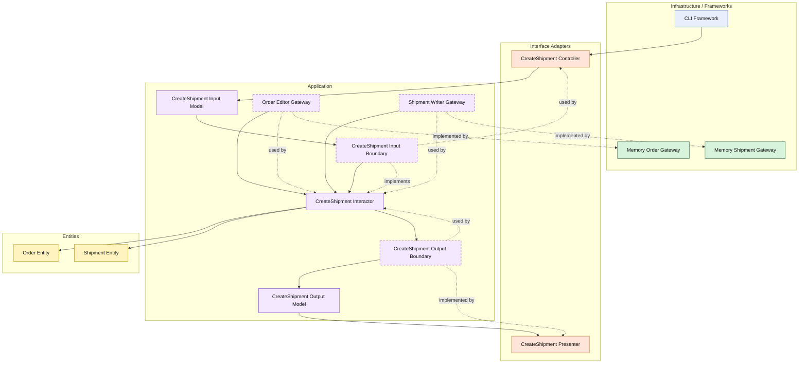

# Lesson 010: Shipment Creation After Payment

## Objective

Add shipment creation after payment, so the Clean Architecture track now shows the first end-to-end order fulfillment gate: reservation, payment, then shipment.

## Theory

By this point the order can be:

- created from an approved quote
- reserved against inventory
- marked as paid

The next natural step is shipment.

This lesson is useful because shipment is not just another order status update.

It introduces:

- a second entity on the order side
- a new persistence boundary
- an additional state rule on the order

The use case now coordinates:

- loading the order
- asking the order entity whether shipment is allowed
- creating a shipment entity
- saving the shipment
- updating the order state

This is exactly the kind of flow the application layer exists to coordinate in Clean Architecture.

The entity owns shipment eligibility.

The shipment entity owns shipment data.

The interactor owns the sequencing across those concepts and boundaries.

The tradeoff is another gateway and another use case to wire.

## Why This Matters Here

This lesson completes the first narrow happy path of the sample application:

- draft quote
- add line
- submit / approve
- convert to order
- reserve stock
- capture payment
- create shipment

That makes later reverse flows like cancellation and returns easier to introduce because the forward lifecycle is now visible.

## Diagram

Legend:

- blue: framework edge
- green: data adapter
- orange: functionality / translation adapter
- purple: application layer
- yellow: entity layer
- dashed border: interface / contract
- dashed arrow: structural relationship

## Implementation Focus

Implement one use case:

- create a shipment for a paid order

The code should show:

- a `Shipment` entity
- a shipped order status
- entity validation that only paid orders can be shipped
- a shipment gateway contract and in-memory adapter
- the CLI demo creating a shipment after payment

Do not add partial shipment or shipment queries yet.

## What To Verify

- the project compiles
- `go test ./...` passes
- a paid order can be shipped
- an unpaid order cannot be shipped
