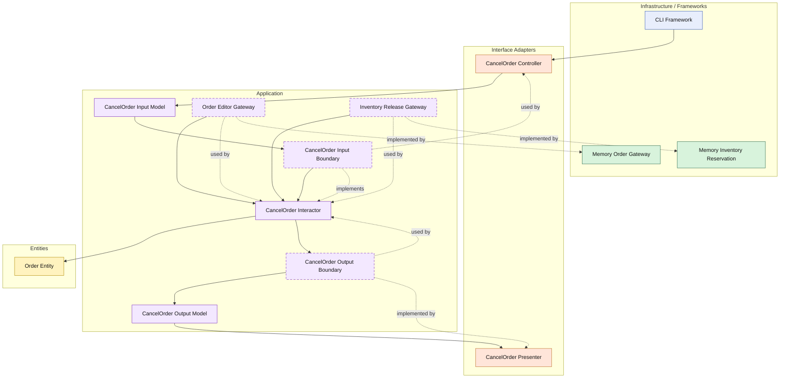

# Lesson 011: Order Cancellation And Release

## Objective

Add order cancellation before shipment and release reserved inventory as part of that workflow, so the Clean Architecture track now includes its first reverse-order path.

## Theory

A forward workflow is not enough to understand an architecture.

Real business systems also need reverse paths:

- undo reserved stock
- stop the order lifecycle
- reject actions that are no longer valid

Order cancellation is the first good example here because it forces the application layer to coordinate:

- loading the order
- asking the entity whether cancellation is still allowed
- releasing reserved inventory
- saving the updated order

This is valuable because it highlights a common architectural tension:

- the entity should own whether its lifecycle permits cancellation
- the inventory release is an external side effect
- the interactor must sequence those concerns safely

The tradeoff is more workflow orchestration and another inventory-side contract.

## Why This Matters Here

At this point the Clean track has a complete narrow happy path.

The next thing a student should see is that the same architecture must also handle a rollback-style path without collapsing business rules into infrastructure code.

Cancellation is the smallest version of that lesson.

## Diagram

Legend:

- blue: framework edge
- green: data adapter
- orange: functionality / translation adapter
- purple: application layer
- yellow: entity layer
- dashed border: interface / contract
- dashed arrow: structural relationship

## Implementation Focus

Implement one use case:

- cancel an order that has not yet been shipped

The code should show:

- a cancelled order status
- entity validation that shipped orders cannot be cancelled
- an inventory release contract
- the existing in-memory inventory adapter implementing release
- cancellation releasing stock before the order is saved

Do not add refunds or return requests yet.

## What To Verify

- the project compiles
- `go test ./...` passes
- an unshipped order can be cancelled and stock is released
- a shipped order cannot be cancelled
