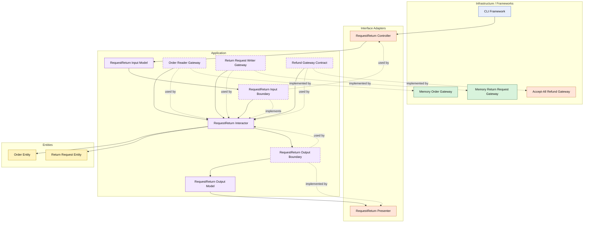

# Lesson 012: Return Request And Refund Boundary

## Objective

Add the first post-shipment reverse workflow by introducing return requests and a refund gateway boundary.

## Theory

Cancellation and returns are not the same thing.

Cancellation happens before fulfillment is complete.

Returns happen after shipment and usually involve a different business path:

- the order has already moved forward
- the customer is asking to reverse part of that outcome
- refund is not an entity-only decision because it crosses a payment boundary

That makes returns a useful Clean Architecture lesson because the workflow now has to coordinate:

- loading the order
- checking that the order is in a returnable state
- creating a return request entity
- calling a refund gateway
- saving the return request

This reinforces a key Clean point:

- the application layer owns workflow sequencing
- the entities own local validity rules
- external money movement stays behind a contract

The tradeoff is another entity, another gateway, and another write path.

## Why This Matters Here

The order lifecycle is now complete enough that the next useful step is not another forward action.

It is a post-fulfillment reverse path with different constraints from cancellation.

That makes the difference between:

- pre-shipment reversal
- post-shipment reversal

architecturally visible instead of only conceptually mentioned.

## Diagram

Legend:

- blue: framework edge
- green: data adapter
- orange: functionality / policy / translation adapter
- purple: application layer
- yellow: entity layer
- dashed border: interface / contract
- dashed arrow: structural relationship

## Implementation Focus

Implement one use case:

- request a return for a shipped order and issue a refund

The code should show:

- a `ReturnRequest` entity
- entity validation that only shipped orders can be returned
- a refund gateway contract
- a return request gateway contract and in-memory adapter
- the CLI demo path staying unchanged while tests cover the return workflow

Do not add return review or restocking yet.

## What To Verify

- the project compiles
- `go test ./...` passes
- a shipped order can produce a return request
- a non-shipped order cannot be returned
