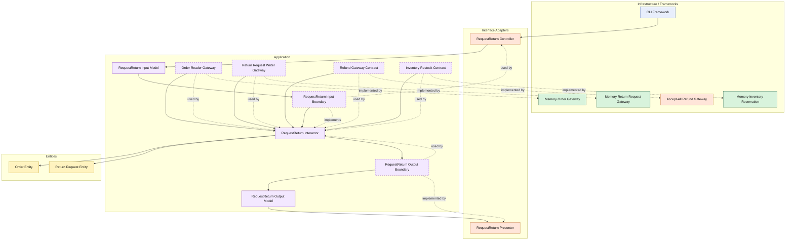

# Lesson 013: Return Restocking Boundary

## Objective

Extend the return workflow so refunded returns also restock inventory through a dedicated contract.

## Theory

The previous lesson established the money side of a return:

- shipped order
- refund gateway
- return request record

But one side effect was still missing:

- the stock that left during fulfillment has not been put back

That makes restocking the natural next step.

This is useful architecturally because it shows that one use case can coordinate multiple external side effects without pushing those details into the entity:

- refund money
- restock inventory
- save the return request

The return request entity still owns its own local meaning.

The restock operation stays behind an application-owned contract.

The interactor owns the sequencing.

The tradeoff is another boundary and another operational dependency in the same workflow.

## Why This Matters Here

Without restocking, the reverse workflow is incomplete from an inventory perspective.

This lesson closes that gap and makes the post-shipment reversal more realistic:

- cancellation releases reservation
- returns refund money and restock inventory

That distinction is important for understanding how the architecture treats similar-but-different workflows.

## Diagram

Legend:

- blue: framework edge
- green: data adapter
- orange: functionality / policy / translation adapter
- purple: application layer
- yellow: entity layer
- dashed border: interface / contract
- dashed arrow: structural relationship

## Implementation Focus

Extend one existing use case:

- request a return, refund the order, and restock inventory

The code should show:

- an inventory restock contract
- restock items derived from the order lines
- the existing in-memory inventory adapter implementing restock
- the return use case coordinating refund, restock, and persistence

Do not add return review or partial returns yet.

## What To Verify

- the project compiles
- `go test ./...` passes
- a shipped order return refunds and restocks
- a non-shipped order still cannot be returned
