# Lesson 014: Return Review Boundary

## Objective

Insert an explicit review step into the return workflow, so return requests no longer jump directly from creation to refund and restock.

## Theory

The previous lessons established that returns are different from cancellations and that returns can trigger both refund and restock.

But the workflow was still too compressed:

- request return
- refund immediately
- restock immediately

That leaves no space for review.

In many systems, return handling needs a separate decision point:

- the customer requests a return
- the return waits for review
- the business accepts or rejects it
- only accepted returns trigger refund and restock

This is architecturally useful because it separates:

- request creation
- review decision
- external side effects

The return entity now owns more of its own lifecycle, while the application layer coordinates different use cases over that lifecycle.

The tradeoff is more states, more use cases, and more workflow branching.

## Why This Matters Here

Without a review step, the return flow is too optimistic and skips an important business boundary.

This lesson makes the architecture more realistic and also shows one of Clean Architecture’s strengths:

- one entity
- multiple focused interactors
- explicit state transitions
- side effects only on the right branch

## Diagram

```mermaid
flowchart TD
    subgraph INFRA[Infrastructure / Frameworks]
        CLI[CLI Framework]
        MOG[Memory Order Gateway]
        MRG[Memory Return Request Gateway]
        RFG[Accept-All Refund Gateway]
        MIR[Memory Inventory Reservation]
    end

    subgraph IA[Interface Adapters]
        RCTRL[RequestReturn Controller]
        ACTRL[AcceptReturn Controller]
        XCTRL[RejectReturn Controller]
        RPRES[RequestReturn Presenter]
        APRES[AcceptReturn Presenter]
        XPRES[RejectReturn Presenter]
    end

    subgraph APP[Application]
        RIN[RequestReturn Input Model]
        RINB[RequestReturn Input Boundary]
        RUC[RequestReturn Interactor]
        AIN[AcceptReturn Input Model]
        AINB[AcceptReturn Input Boundary]
        AUC[AcceptReturn Interactor]
        XIN[RejectReturn Input Model]
        XINB[RejectReturn Input Boundary]
        XUC[RejectReturn Interactor]
        OG[Order Reader Gateway]
        RRG[Return Request Gateway]
        REF[Refund Gateway Contract]
        RES[Inventory Restock Contract]
        ROUT[RequestReturn Output Model]
        ROUTB[RequestReturn Output Boundary]
        AOUT[AcceptReturn Output Model]
        AOUTB[AcceptReturn Output Boundary]
        XOUT[RejectReturn Output Model]
        XOUTB[RejectReturn Output Boundary]
    end

    subgraph ENT[Entities]
        ORDER[Order Entity]
        RET[Return Request Entity]
    end

    CLI --> RCTRL --> RIN --> RINB --> RUC
    CLI --> ACTRL --> AIN --> AINB --> AUC
    CLI --> XCTRL --> XIN --> XINB --> XUC
    OG --> RUC
    RRG --> RUC
    RRG --> AUC
    RRG --> XUC
    REF --> AUC
    RES --> AUC
    RUC --> ORDER
    RUC --> RET
    AUC --> RET
    XUC --> RET
    RUC --> ROUTB --> ROUT --> RPRES
    AUC --> AOUTB --> AOUT --> APRES
    XUC --> XOUTB --> XOUT --> XPRES

    RINB -.used by.-> RCTRL
    RINB -.implements.-> RUC
    AINB -.used by.-> ACTRL
    AINB -.implements.-> AUC
    XINB -.used by.-> XCTRL
    XINB -.implements.-> XUC
    OG -.used by.-> RUC
    OG -.implemented by.-> MOG
    RRG -.used by.-> RUC
    RRG -.used by.-> AUC
    RRG -.used by.-> XUC
    RRG -.implemented by.-> MRG
    REF -.used by.-> AUC
    REF -.implemented by.-> RFG
    RES -.used by.-> AUC
    RES -.implemented by.-> MIR
    ROUTB -.used by.-> RUC
    ROUTB -.implemented by.-> RPRES
    AOUTB -.used by.-> AUC
    AOUTB -.implemented by.-> APRES
    XOUTB -.used by.-> XUC
    XOUTB -.implemented by.-> XPRES

    classDef framework fill:#e8eefc,stroke:#3559b5,color:#111;
    classDef dataadapter fill:#d8f3dc,stroke:#2d6a4f,color:#111;
    classDef funcadapter fill:#ffe5d9,stroke:#bc6c25,color:#111;
    classDef app fill:#f3e8ff,stroke:#7b2cbf,color:#111;
    classDef entity fill:#fff3bf,stroke:#b08900,color:#111;
    classDef contract stroke-dasharray: 6 4;

    class CLI framework;
    class MOG,MRG,MIR dataadapter;
    class RFG,RCTRL,ACTRL,XCTRL,RPRES,APRES,XPRES funcadapter;
    class RIN,RINB,RUC,AIN,AINB,AUC,XIN,XINB,XUC,OG,RRG,REF,RES,ROUT,ROUTB,AOUT,AOUTB,XOUT,XOUTB app;
    class ORDER,RET entity;
    class RINB,AINB,XINB,OG,RRG,REF,RES,ROUTB,AOUTB,XOUTB contract;
```

Legend:

- blue: framework edge
- green: data adapter
- orange: functionality / policy / translation adapter
- purple: application layer
- yellow: entity layer
- dashed border: interface / contract
- dashed arrow: structural relationship

## Implementation Focus

Refactor the return workflow into:

- request return
- accept return
- reject return

The code should show:

- `Requested`, `Accepted`, `Rejected`, and `Refunded` return states
- return request creation no longer refunding immediately
- acceptance triggering refund and restock
- rejection blocking refund and restock

Do not add reviewer metadata or return-window policy yet.

## What To Verify

- the project compiles
- `go test ./...` passes
- request creates a `Requested` return
- accepting refunds and restocks
- rejecting prevents refund/restock
