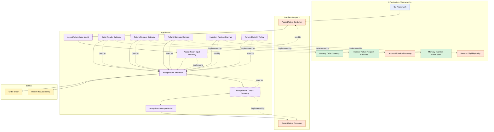

# Lesson 015: Return Eligibility Policy

## Objective

Make return acceptance depend on a dedicated eligibility policy contract instead of allowing any requested return to be accepted unconditionally.

## Theory

The previous lesson introduced review as a separate step.

That was useful because it split:

- creating a return request
- accepting a return
- rejecting a return

But the acceptance path was still too permissive.

The interactor would accept any request that was still in the `Requested` state.

In many systems, return review depends on additional policy questions:

- is the reason acceptable?
- is the product category returnable?
- is the request inside the allowed window?

Those rules do not belong inside the review controller, and they do not have to live directly inside the entity either.

They are a good application-layer policy seam.

So the acceptance flow now becomes:

- load the return request
- load the order
- ask the eligibility policy whether this return may be accepted
- if allowed, continue with refund and restock

This is a good Clean Architecture lesson because it shows that a review use case can depend on both:

- entity lifecycle rules
- replaceable business policy boundaries

The tradeoff is another contract and another adapter.

## Why This Matters Here

Without an eligibility policy, the review step is mostly manual ceremony.

With a policy seam, the architecture now shows a more realistic distinction:

- reviewers act inside a policy framework
- the use case enforces that policy through a contract

This also prepares the next lesson naturally if you want a real time-based return window later.

## Diagram

Legend:

- blue: framework edge
- green: data adapter
- orange: functionality / policy / translation adapter
- purple: application layer
- yellow: entity layer
- dashed border: interface / contract
- dashed arrow: structural relationship

## Implementation Focus

Extend one existing use case:

- accept a return only when the eligibility policy allows it

The code should show:

- a return eligibility policy contract
- a simple concrete policy adapter
- `AcceptReturn` consulting that policy before refund and restock
- tests for both allowed and blocked acceptance

Do not add a real date-based return window yet.

## What To Verify

- the project compiles
- `go test ./...` passes
- eligible returns can still be accepted
- policy-blocked returns stay `Requested`
