# Lesson 016: Real Return Window Policy

## Objective

Replace the placeholder return-eligibility rule with a real date-based return-window policy and introduce time as an explicit application boundary.

## Theory

The previous lesson introduced a useful architectural seam:

- `AcceptReturn` consults a `ReturnEligibilityPolicy`

That was the right boundary.

But the concrete rule was still a placeholder:

- reject when the reason string equals `outside return window`

That is good enough to show the policy shape, but not good enough to teach a realistic policy.

Real return eligibility usually depends on time:

- when the order shipped
- how many return days were allowed for the ordered product
- when the return was requested

That makes this lesson useful for two reasons:

- it upgrades the return policy from a stub to a real rule
- it introduces time as another explicit dependency instead of calling the system clock directly from inside business logic

So the application layer now owns:

- a clock contract
- the act of stamping `ShippedAt`
- the act of stamping `RequestedAt`
- a policy that compares those snapshots

The tradeoff is more data carried through entities and another contract to wire.

## Why This Matters Here

This lesson turns the policy seam into something concrete enough to compare meaningfully with other architectures.

It also shows a subtle but important Clean Architecture habit:

- time is an external concern
- but business logic often depends on time

So time should be inverted behind a boundary just like payment, refund, or inventory.

## Diagram

```mermaid
flowchart TD
    subgraph INFRA[Infrastructure / Frameworks]
        CLI[CLI Framework]
        MOG[Memory Order Gateway]
        MRG[Memory Return Request Gateway]
        RFG[Accept-All Refund Gateway]
        MIR[Memory Inventory Reservation]
        WEP[Window Eligibility Policy]
        CLK[Clock Adapter]
    end

    subgraph IA[Interface Adapters]
        RCTRL[RequestReturn Controller]
        ACTRL[AcceptReturn Controller]
        RPRES[RequestReturn Presenter]
        APRES[AcceptReturn Presenter]
    end

    subgraph APP[Application]
        RIN[RequestReturn Input Model]
        RINB[RequestReturn Input Boundary]
        RUC[RequestReturn Interactor]
        AIN[AcceptReturn Input Model]
        AINB[AcceptReturn Input Boundary]
        AUC[AcceptReturn Interactor]
        OG[Order Reader Gateway]
        RRG[Return Request Gateway]
        REF[Refund Gateway Contract]
        RES[Inventory Restock Contract]
        ELI[Return Eligibility Policy]
        TIME[Clock Contract]
        ROUT[RequestReturn Output Model]
        ROUTB[RequestReturn Output Boundary]
        AOUT[AcceptReturn Output Model]
        AOUTB[AcceptReturn Output Boundary]
    end

    subgraph ENT[Entities]
        ORDER[Order Entity]
        RET[Return Request Entity]
    end

    CLI --> RCTRL --> RIN --> RINB --> RUC
    CLI --> ACTRL --> AIN --> AINB --> AUC
    OG --> RUC
    RRG --> RUC
    TIME --> RUC
    OG --> AUC
    RRG --> AUC
    REF --> AUC
    RES --> AUC
    ELI --> AUC
    RUC --> ORDER
    RUC --> RET
    AUC --> ORDER
    AUC --> RET
    RUC --> ROUTB --> ROUT --> RPRES
    AUC --> AOUTB --> AOUT --> APRES

    RINB -.used by.-> RCTRL
    RINB -.implements.-> RUC
    AINB -.used by.-> ACTRL
    AINB -.implements.-> AUC
    OG -.used by.-> RUC
    OG -.used by.-> AUC
    OG -.implemented by.-> MOG
    RRG -.used by.-> RUC
    RRG -.used by.-> AUC
    RRG -.implemented by.-> MRG
    TIME -.used by.-> RUC
    TIME -.implemented by.-> CLK
    REF -.used by.-> AUC
    REF -.implemented by.-> RFG
    RES -.used by.-> AUC
    RES -.implemented by.-> MIR
    ELI -.used by.-> AUC
    ELI -.implemented by.-> WEP
    ROUTB -.used by.-> RUC
    ROUTB -.implemented by.-> RPRES
    AOUTB -.used by.-> AUC
    AOUTB -.implemented by.-> APRES

    classDef framework fill:#e8eefc,stroke:#3559b5,color:#111;
    classDef dataadapter fill:#d8f3dc,stroke:#2d6a4f,color:#111;
    classDef funcadapter fill:#ffe5d9,stroke:#bc6c25,color:#111;
    classDef app fill:#f3e8ff,stroke:#7b2cbf,color:#111;
    classDef entity fill:#fff3bf,stroke:#b08900,color:#111;
    classDef contract stroke-dasharray: 6 4;

    class CLI framework;
    class MOG,MRG,MIR dataadapter;
    class RFG,WEP,CLK,RCTRL,ACTRL,RPRES,APRES funcadapter;
    class RIN,RINB,RUC,AIN,AINB,AUC,OG,RRG,REF,RES,ELI,TIME,ROUT,ROUTB,AOUT,AOUTB app;
    class ORDER,RET entity;
    class RINB,AINB,OG,RRG,REF,RES,ELI,TIME,ROUTB,AOUTB contract;
```

Legend:

- blue: framework edge
- green: data adapter
- orange: functionality / policy / translation adapter
- purple: application layer
- yellow: entity layer
- dashed border: interface / contract
- dashed arrow: structural relationship

## Implementation Focus

Extend the return flow with:

- a clock contract
- shipment timestamp capture
- return request timestamp capture
- product return-window snapshots flowing through the order
- a real date-based eligibility policy

Do not add reviewer metadata yet.

## What To Verify

- the project compiles
- `go test ./...` passes
- a request inside the allowed window can be accepted
- a request outside the allowed window stays blocked
