# Lesson 017: Return Actor Metadata

## Objective

Make the return workflow auditable by carrying actor identity through request, review, and refund processing.

## Theory

The return workflow now has real stages:

- request
- review
- refund/restock

But it still lacks an important business concern:

- who did what?

In real systems, return handling often needs an audit trail for at least three actions:

- who requested the return
- who reviewed the return
- who processed the refund path

This is a useful Clean Architecture lesson because the workflow becomes richer without requiring a new external system.

The entity now carries more business-relevant metadata.

The use cases become responsible for supplying that metadata at the right stage.

The tradeoff is more input fields and more validation in the entity lifecycle methods.

## Why This Matters Here

Without actor metadata, the return flow is functionally correct but operationally weak.

With it, the architecture shows that not all important behavior is about external integrations. Some of it is about preserving business accountability inside the model and the use cases.

This is also a good preparation step for later ideas like audit logs, reviewer policies, or idempotent command processing.

## Diagram

```mermaid
flowchart TD
    subgraph INFRA[Infrastructure / Frameworks]
        CLI[CLI Framework]
        MOG[Memory Order Gateway]
        MRG[Memory Return Request Gateway]
        RFG[Accept-All Refund Gateway]
        MIR[Memory Inventory Reservation]
        WEP[Window Eligibility Policy]
        CLK[Clock Adapter]
    end

    subgraph IA[Interface Adapters]
        RCTRL[RequestReturn Controller]
        ACTRL[AcceptReturn Controller]
        XCTRL[RejectReturn Controller]
        RPRES[RequestReturn Presenter]
        APRES[AcceptReturn Presenter]
        XPRES[RejectReturn Presenter]
    end

    subgraph APP[Application]
        RUC[RequestReturn Interactor]
        AUC[AcceptReturn Interactor]
        XUC[RejectReturn Interactor]
        OG[Order Reader Gateway]
        RRG[Return Request Gateway]
        REF[Refund Gateway Contract]
        RES[Inventory Restock Contract]
        ELI[Return Eligibility Policy]
        TIME[Clock Contract]
    end

    subgraph ENT[Entities]
        ORDER[Order Entity]
        RET[Return Request Entity<br/>RequestedBy ReviewedBy ProcessedBy ReviewNote]
    end

    CLI --> RCTRL --> RUC
    CLI --> ACTRL --> AUC
    CLI --> XCTRL --> XUC
    OG --> RUC
    RRG --> RUC
    TIME --> RUC
    OG --> AUC
    RRG --> AUC
    REF --> AUC
    RES --> AUC
    ELI --> AUC
    RRG --> XUC
    RUC --> RET
    AUC --> RET
    XUC --> RET
    AUC --> ORDER
    APRES --> CLI
    RPRES --> CLI
    XPRES --> CLI

    OG -.implemented by.-> MOG
    RRG -.implemented by.-> MRG
    REF -.implemented by.-> RFG
    RES -.implemented by.-> MIR
    ELI -.implemented by.-> WEP
    TIME -.implemented by.-> CLK

    classDef framework fill:#e8eefc,stroke:#3559b5,color:#111;
    classDef dataadapter fill:#d8f3dc,stroke:#2d6a4f,color:#111;
    classDef funcadapter fill:#ffe5d9,stroke:#bc6c25,color:#111;
    classDef app fill:#f3e8ff,stroke:#7b2cbf,color:#111;
    classDef entity fill:#fff3bf,stroke:#b08900,color:#111;
    classDef contract stroke-dasharray: 6 4;

    class CLI framework;
    class MOG,MRG,MIR dataadapter;
    class RFG,WEP,CLK,RCTRL,ACTRL,XCTRL,RPRES,APRES,XPRES funcadapter;
    class RUC,AUC,XUC,OG,RRG,REF,RES,ELI,TIME app;
    class ORDER,RET entity;
    class OG,RRG,REF,RES,ELI,TIME contract;
```

Legend:

- blue: framework edge
- green: data adapter
- orange: functionality / policy / translation adapter
- purple: application layer
- yellow: entity layer
- dashed border: interface / contract

## Implementation Focus

Extend the return workflow with:

- `RequestedBy`
- `ReviewedBy`
- `ProcessedBy`
- `ReviewNote`

The code should show:

- actor-required validation on the entity
- request use case capturing the requester
- accept use case capturing reviewer and processor
- reject use case capturing reviewer and note

Do not add idempotency yet.

## What To Verify

- the project compiles
- `go test ./...` passes
- actor fields are stored through the workflow
- missing actors are rejected
