# Lesson 018: Return Command Idempotency

## Objective

Make the return review commands safe to retry without repeating refund or restock side effects.

## Theory

The return workflow now has:

- actor metadata
- review decisions
- real refund and restock side effects

That makes duplicate command delivery a real operational problem.

A controller, CLI, or HTTP client may retry a command because of:

- timeouts
- network uncertainty
- user double submission

Without idempotency, a duplicate `accept return` command could refund twice and restock twice.

Clean Architecture handles this by letting the application layer own an explicit idempotency contract.

The interactors decide:

- which commands need idempotency
- when a command result becomes durable
- what result should be returned on a duplicate retry

The infrastructure layer only stores keys and result references.

The tradeoff is more input and one more gateway-like contract in the application layer.

## Why This Matters Here

The return review flow is now past the stage where "business rule correctness" is enough.

It also needs operational safety.

This lesson shows that Clean Architecture is not only about separating business rules from frameworks. It also lets the application layer own reliability-oriented policies such as command retry behavior.

## Diagram

```mermaid
flowchart TD
    subgraph INFRA["Infrastructure / Frameworks"]
        CLI["CLI / HTTP Framework"]
        MOG["Memory Order Gateway"]
        MRG["Memory Return Request Gateway"]
        IDS["Memory Idempotency Store"]
        RFG["Accept-All Refund Gateway"]
        MIR["Memory Inventory Reservation"]
        WEP["Window Eligibility Policy"]
    end

    subgraph IA["Interface Adapters"]
        ACTRL["AcceptReturn Controller"]
        XCTRL["RejectReturn Controller"]
        APRES["AcceptReturn Presenter"]
        XPRES["RejectReturn Presenter"]
    end

    subgraph APP["Application"]
        AIN["AcceptReturn Input Boundary"]
        AOUT["AcceptReturn Output Boundary"]
        XIN["RejectReturn Input Boundary"]
        XOUT["RejectReturn Output Boundary"]
        AUC["AcceptReturn Interactor"]
        XUC["RejectReturn Interactor"]
        OED["Order Editor"]
        RRE["Return Request Editor"]
        IDEMP["Idempotency Store"]
        REF["Refund Gateway"]
        RES["Inventory Restock"]
        ELI["Return Eligibility Policy"]
    end

    subgraph ENT["Entities"]
        ORD["Order Entity"]
        RET["Return Request Entity"]
    end

    CLI --> ACTRL
    CLI --> XCTRL
    ACTRL --> AIN
    XCTRL --> XIN
    AUC --> AOUT
    XUC --> XOUT
    APRES --> CLI
    XPRES --> CLI

    AIN -.used by.-> ACTRL
    AIN -.implemented by.-> AUC
    AOUT -.used by.-> AUC
    AOUT -.implemented by.-> APRES
    XIN -.used by.-> XCTRL
    XIN -.implemented by.-> XUC
    XOUT -.used by.-> XUC
    XOUT -.implemented by.-> XPRES

    IDEMP -.used by.-> AUC
    IDEMP -.used by.-> XUC
    OED -.used by.-> AUC
    RRE -.used by.-> AUC
    RRE -.used by.-> XUC
    REF -.used by.-> AUC
    RES -.used by.-> AUC
    ELI -.used by.-> AUC

    OED -.implemented by.-> MOG
    RRE -.implemented by.-> MRG
    IDEMP -.implemented by.-> IDS
    REF -.implemented by.-> RFG
    RES -.implemented by.-> MIR
    ELI -.implemented by.-> WEP

    AUC --> ORD
    AUC --> RET
    XUC --> RET

    classDef framework fill:#e8eefc,stroke:#3559b5,color:#111;
    classDef dataadapter fill:#d8f3dc,stroke:#2d6a4f,color:#111;
    classDef funcadapter fill:#ffe5d9,stroke:#bc6c25,color:#111;
    classDef app fill:#f3e8ff,stroke:#7b2cbf,color:#111;
    classDef entity fill:#fff3bf,stroke:#b08900,color:#111;
    classDef contract stroke-dasharray: 6 4;

    class CLI framework;
    class MOG,MRG,IDS,MIR dataadapter;
    class RFG,WEP,ACTRL,XCTRL,APRES,XPRES funcadapter;
    class AIN,AOUT,XIN,XOUT,AUC,XUC,OED,RRE,IDEMP,REF,RES,ELI app;
    class ORD,RET entity;
    class AIN,AOUT,XIN,XOUT,OED,RRE,IDEMP,REF,RES,ELI contract;
```

Legend:

- blue: framework edge
- green: data adapter
- orange: functionality / policy / translation adapter
- purple: application layer
- yellow: entity layer
- dashed border: interface / contract
- dashed arrow: structural relationship such as `used by` or `implemented by`

## Implementation Focus

Add an application-owned `IdempotencyStore` contract and use it in:

- `AcceptReturn`
- `RejectReturn`

The code should show:

- idempotency key required by the command input
- duplicate retries short-circuiting to the already saved return request
- refund and restock happening only on the first successful accept
- infrastructure storing keys without owning the workflow logic

## What To Verify

- the project compiles
- `go test ./...` passes
- duplicate `accept return` retries do not refund twice
- duplicate `reject return` retries do not rewrite the return request
- missing idempotency keys are rejected
