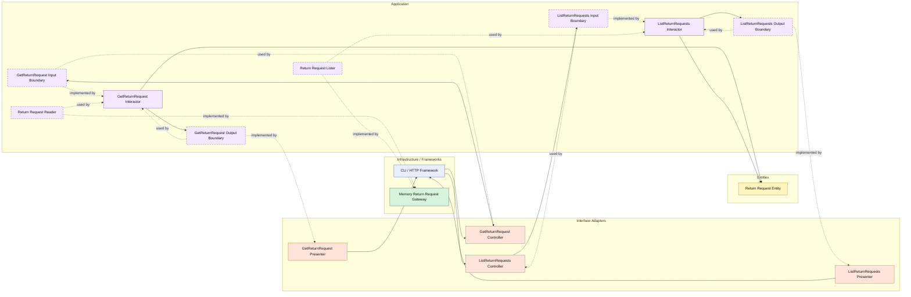

# Lesson 019: Return Query Surface

## Objective

Add explicit read-side use cases for return requests instead of letting callers read the return gateway directly.

## Theory

The return workflow now has a meaningful write side:

- request
- review
- refund
- idempotent retry behavior

But without a query surface, the read path is still implicit.

Clean Architecture treats reads as use cases too.

That means even a simple lookup or list should still pass through:

- controller
- input boundary
- interactor
- gateway contract
- output boundary
- presenter

This can feel heavier than reading a repository directly, but it keeps the application layer in control of:

- which data is exposed
- how it is shaped
- which queries are considered valid application behavior

The tradeoff is more types for what might look like "just a read."

## Why This Matters Here

The return workflow is now one of the richer slices in the Clean track.

Adding a query surface makes the architecture more honest: the same return feature now has both write-side and read-side seams.

It also makes the controller/presenter pattern easier to compare against Hexagonal and Layered approaches, because the read path is no longer hidden inside infrastructure.

## Diagram

Legend:

- blue: framework edge
- green: data adapter
- orange: translation adapter
- purple: application layer
- yellow: entity layer
- dashed border: interface / contract
- dashed arrow: structural relationship such as `used by` or `implemented by`

## Implementation Focus

Add:

- `GetReturnRequest`
- `ListReturnRequests`

The code should show:

- one read use case for loading a single return request
- one read use case for listing return requests by status
- the return gateway implementing reader and lister contracts
- presenters shaping the query result instead of leaking entity values directly to the outer layer

## What To Verify

- the project compiles
- `go test ./...` passes
- a return request can be loaded through a query interactor
- requested returns can be listed by status
