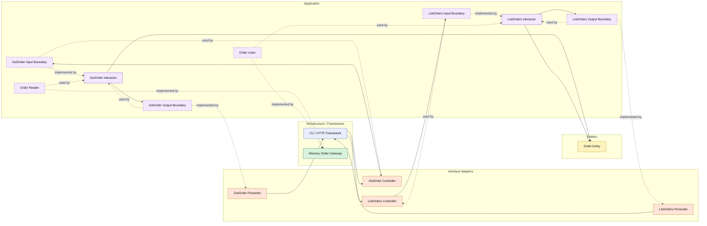

# Lesson 020: Order Query Surface

## Objective

Add explicit read-side use cases for orders so the order slice has the same Clean Architecture query seam as quotes and return requests.

## Theory

Orders already have a substantial write workflow:

- conversion from quote
- payment capture
- shipment creation
- cancellation

But without dedicated query use cases, reads still happen only as internal support for write-side interactors.

Clean Architecture treats order reads as application behavior too.

That means a caller should not jump straight from a controller into a concrete order gateway.

Instead, the read path should still go through:

- input boundary
- interactor
- output boundary
- presenter

The benefit is consistency.

The application layer decides:

- which order data is exposed
- which filters exist
- which read scenarios are officially supported

The tradeoff is more code for operations that may seem simple.

## Why This Matters Here

The return query lesson showed that reads are first-class in Clean Architecture.

Orders are the next natural slice because they sit in the center of the workflow and are already reused by many write-side use cases.

This lesson makes that central concept readable through the same boundary structure rather than only through internal collaborators.

## Diagram

Legend:

- blue: framework edge
- green: data adapter
- orange: translation adapter
- purple: application layer
- yellow: entity layer
- dashed border: interface / contract
- dashed arrow: structural relationship such as `used by` or `implemented by`

## Implementation Focus

Add:

- `GetOrder`
- `ListOrders`

The code should show:

- a single-order query use case
- a list-by-status query use case
- the order gateway implementing reader and lister contracts
- presenters shaping the result for callers instead of exposing raw entities

## What To Verify

- the project compiles
- `go test ./...` passes
- an order can be loaded through a query interactor
- paid orders can be listed by status
