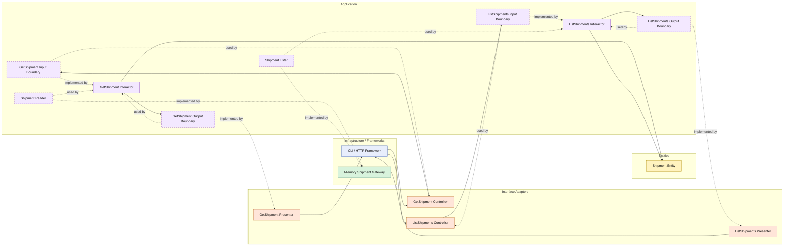

# Lesson 021: Shipment Query Surface

## Objective

Add explicit read-side use cases for shipments so the fulfillment slice has the same query boundary shape as quotes, returns, and orders.

## Theory

Shipments already exist on the write side:

- an order is paid
- a shipment is created
- the order moves to shipped

But without read use cases, shipment access still lives only inside infrastructure.

Clean Architecture treats shipment queries as application behavior too.

That means even a simple shipment lookup should still pass through:

- input boundary
- interactor
- output boundary
- presenter

This lesson also shows that query filters do not have to copy the write-side status pattern exactly.

For shipments, the natural list filter is:

- by `OrderID`

The benefit is that the application layer still owns:

- which shipment queries are allowed
- how shipment data is shaped
- how callers depend on shipment reads

The tradeoff is more code around a small read path.

## Why This Matters Here

Orders and returns already have explicit query seams.

Shipments are the missing workflow object in that same read-side pattern.

Adding this lesson makes the fulfillment path easier to compare across architectures because shipment reads are now visible as first-class Clean use cases instead of hidden infrastructure access.

## Diagram

Legend:

- blue: framework edge
- green: data adapter
- orange: translation adapter
- purple: application layer
- yellow: entity layer
- dashed border: interface / contract
- dashed arrow: structural relationship such as `used by` or `implemented by`

## Implementation Focus

Add:

- `GetShipment`
- `ListShipments`

The code should show:

- a single-shipment query use case
- a list-by-order query use case
- the shipment gateway implementing reader and lister contracts
- presenters shaping shipment read models for callers

## What To Verify

- the project compiles
- `go test ./...` passes
- a shipment can be loaded through a query interactor
- shipments can be listed by order id
