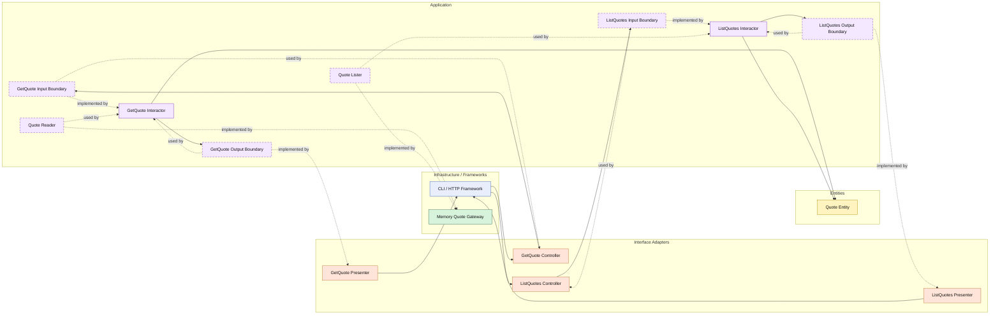

# Lesson 022: Quote List Query Surface

## Objective

Add list-by-status querying for quotes so the quote slice has the same explicit read-side surface as orders, returns, and shipments.

## Theory

Quotes already introduced the first Clean Architecture query lesson through:

- `GetQuote`

But that still leaves the quote read side narrower than the other main workflow objects.

Clean Architecture treats query breadth as application behavior too.

The question is not only:

- can we load one quote?

It is also:

- which quote listing scenarios does the application officially support?

This lesson keeps the same boundary pattern:

- controller
- input boundary
- interactor
- gateway contract
- output boundary
- presenter

The benefit is consistency across the architecture.

The application layer, not infrastructure, decides that listing quotes by status is a supported use case and how that result is shaped for callers.

## Why This Matters Here

Quotes start the whole workflow, so they should not end up with a weaker read model than downstream objects.

Adding `ListQuotes` also completes the comparison with the recent order, shipment, and return query lessons and makes the quote slice feel like a full application surface instead of a one-off example.

## Diagram

Legend:

- blue: framework edge
- green: data adapter
- orange: translation adapter
- purple: application layer
- yellow: entity layer
- dashed border: interface / contract
- dashed arrow: structural relationship such as `used by` or `implemented by`

## Implementation Focus

Add:

- `ListQuotes`

The code should show:

- list-by-status as an explicit quote read use case
- the quote gateway implementing a lister contract in addition to single-item lookup
- a presenter shaping quote list results for callers

## What To Verify

- the project compiles
- `go test ./...` passes
- approved quotes can be listed by status
- the existing single-quote query flow still works
