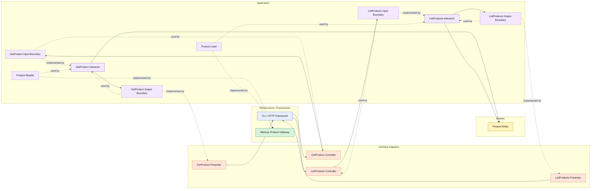

# Lesson 023: Product Query Surface

## Objective

Promote products from a write-side helper gateway into an explicit read-side application surface.

## Theory

So far, products mostly exist to support quote editing:

- load product by SKU
- check availability
- copy product data into a quote line

That is enough for the write side, but it hides an important architectural point:

products are also application data that callers may want to browse directly.

Clean Architecture treats that browsing capability as a use case too.

So instead of letting outer layers read the product gateway directly, the application layer owns:

- which product queries are supported
- how query filters are expressed
- what product data is shaped for callers

This lesson uses two simple read scenarios:

- get product by SKU
- list products by category and availability

The tradeoff is the same as the recent query lessons:

- more small types
- more mapping
- more ceremony around reads

## Why This Matters Here

Products sit near the edge between catalog data and workflow behavior.

Adding a real query surface here makes it easier to compare Clean Architecture with the other tracks, because the catalog no longer appears only as a helper dependency inside another use case.

It also balances the repository: the workflow objects already have explicit reads, and now the supporting catalog entity does too.

## Diagram

Legend:

- blue: framework edge
- green: data adapter
- orange: translation adapter
- purple: application layer
- yellow: entity layer
- dashed border: interface / contract
- dashed arrow: structural relationship such as `used by` or `implemented by`

## Implementation Focus

Add:

- `GetProduct`
- `ListProducts`

The code should show:

- a single-product query use case
- a category and availability list query use case
- the product gateway implementing reader and lister contracts
- presenters shaping product read models for callers

## What To Verify

- the project compiles
- `go test ./...` passes
- a product can be loaded through a query interactor
- products can be listed by category and availability
