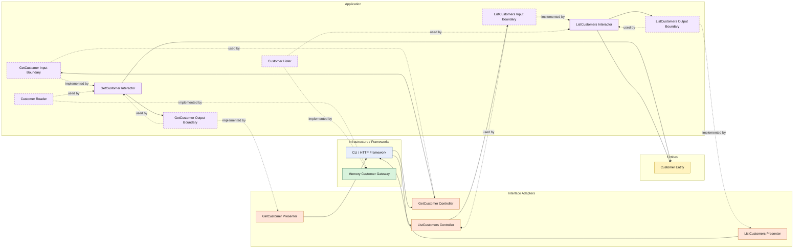

# Lesson 024: Customer Query Surface

## Objective

Promote customers from a supporting lookup dependency into an explicit read-side application surface.

## Theory

So far, customers mostly appear as validation collaborators:

- load customer by id
- ensure the customer is active

That is enough for quote creation, but it keeps customer reads hidden inside other workflows.

Clean Architecture treats those reads as application behavior too.

So instead of letting outer layers depend directly on the customer gateway, the application layer owns:

- which customer queries are supported
- how customer filters are expressed
- how customer data is shaped for callers

This lesson uses two simple read scenarios:

- get customer by id
- list customers with an active-only filter

The tradeoff is the usual read-side ceremony:

- more interfaces
- more mapping
- more small types

## Why This Matters Here

Customers are one of the first entities touched in the workflow, so keeping them as a pure helper would leave the Clean track uneven.

This lesson balances the supporting-entity story with the catalog query lesson and makes it easier to compare how different architectures expose foundational data, not only workflow state.

## Diagram

Legend:

- blue: framework edge
- green: data adapter
- orange: translation adapter
- purple: application layer
- yellow: entity layer
- dashed border: interface / contract
- dashed arrow: structural relationship such as `used by` or `implemented by`

## Implementation Focus

Add:

- `GetCustomer`
- `ListCustomers`

The code should show:

- a single-customer query use case
- an active-only list query use case
- the customer gateway implementing reader and lister contracts
- presenters shaping customer read models for callers

## What To Verify

- the project compiles
- `go test ./...` passes
- a customer can be loaded through a query interactor
- active customers can be listed
