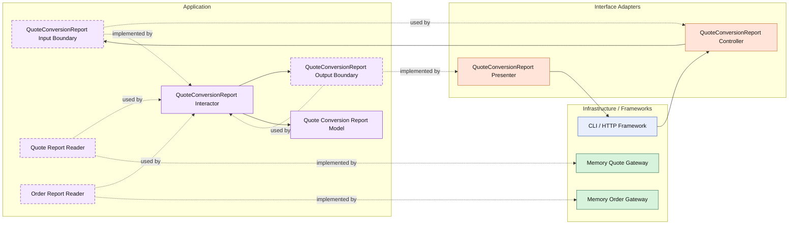

# Lesson 025: Quote Conversion Report

## Objective

Introduce the first projection-style report that combines data from multiple gateways instead of returning a single entity or list.

## Theory

Up to this point, the Clean read side has focused on direct application queries:

- get one thing
- list a group of things

Reports are different.

A report use case often does not expose one entity at all.

Instead, it:

- reads from multiple sources
- combines or aggregates data
- produces a report model owned by the application layer

That is still a Clean Architecture use case.

The important idea is that the report is not "a database query leaking outward."

It is an application-level projection with its own input boundary, output boundary, interactor, and presenter.

This lesson uses a simple quote conversion report:

- total quotes
- approved quotes
- converted quotes
- conversion rate

The tradeoff is that reporting logic can introduce broader reader dependencies than entity-centric queries, but the application layer still owns the meaning of the report.

## Why This Matters Here

The repository now has explicit query surfaces for the main workflow entities.

The next architectural idea is not "another list." It is showing how Clean Architecture handles cross-entity reporting without collapsing straight into infrastructure-shaped SQL thinking.

This lesson makes that distinction visible.

## Diagram

Legend:

- blue: framework edge
- green: data adapter
- orange: translation adapter
- purple: application layer
- dashed border: interface / contract
- dashed arrow: structural relationship such as `used by` or `implemented by`

## Implementation Focus

Add:

- `QuoteConversionReport`

The code should show:

- a reporting interactor that reads from both quotes and orders
- a report output model owned by the application layer
- a presenter shaping the report result for callers

## What To Verify

- the project compiles
- `go test ./...` passes
- the report combines quote and order counts correctly
- the demo can render the report output
