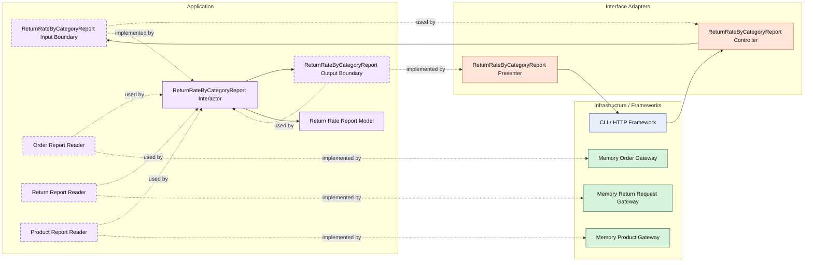

# Lesson 026: Return Rate By Category Report

## Objective

Add a second projection-style report that combines shipped orders, refunded returns, and product category lookup into one application-owned read model.

## Theory

The first report lesson showed that reports are not just "big queries."

They are application projections with their own boundaries.

This lesson goes one step further:

- it reads from multiple workflow sources
- it resolves supporting catalog data
- it groups the result into a category-based metric

The report answers:

- how many units were shipped per category
- how many units were later returned per category
- what the resulting return rate is

That is still a Clean Architecture use case.

The report model does not belong to any one entity.

It belongs to the application layer because the application defines what the metric means.

The tradeoff is broader reader dependencies:

- orders
- returns
- products

But that dependency breadth is explicit and still points inward to application-owned contracts.

## Why This Matters Here

The repository already has entity-centric reads.

This lesson shows a more realistic analytics-style use case, where the application layer must coordinate several data sources to express a business metric that no single aggregate owns by itself.

That makes the reporting story more complete and easier to compare with the other architecture tracks.

## Diagram

Legend:

- blue: framework edge
- green: data adapter
- orange: translation adapter
- purple: application layer
- dashed border: interface / contract
- dashed arrow: structural relationship such as `used by` or `implemented by`

## Implementation Focus

Add:

- `ReturnRateByCategoryReport`

The code should show:

- a report interactor that reads from orders, returns, and products
- category resolution as an explicit supporting dependency
- a presenter shaping the aggregated category metrics for callers

## What To Verify

- the project compiles
- `go test ./...` passes
- shipped and refunded quantities are grouped by category correctly
- the demo can render the report output
