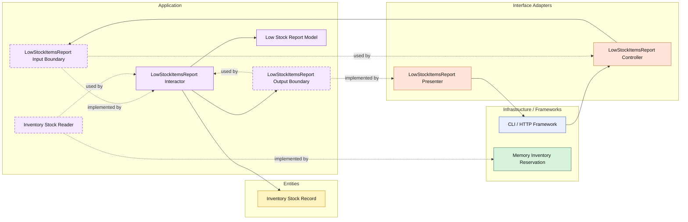

# Lesson 027: Low Stock Items Report

## Objective

Add an inventory-based report that introduces a narrow stock read boundary without turning the Clean track into a full inventory management slice yet.

## Theory

So far, inventory has only appeared as a command-side collaborator:

- reserve stock
- release stock
- restock items

That is enough for workflow behavior, but it does not expose stock as readable application information.

This lesson introduces a small but important idea:

- sometimes a report needs a read seam into a supporting subsystem even if that subsystem does not yet have its own full query use-case family

The report answers:

- which items are at or below a given stock threshold

This is still a Clean Architecture use case.

The application layer owns:

- the threshold input
- the low-stock selection rule
- the report output shape

The infrastructure layer only provides stock snapshots.

## Why This Matters Here

The reporting track now has workflow projections.

This lesson adds an operational projection and shows that reports can also surface infrastructure-backed operational state without giving infrastructure ownership of the report semantics.

It also prepares the ground for richer inventory lessons later if needed.

## Diagram

Legend:

- blue: framework edge
- green: data adapter
- orange: translation adapter
- purple: application layer
- yellow: entity layer
- dashed border: interface / contract
- dashed arrow: structural relationship such as `used by` or `implemented by`

## Implementation Focus

Add:

- `LowStockItemsReport`

The code should show:

- a stock snapshot reader contract owned by the application layer
- threshold filtering in the interactor, not in infrastructure
- a presenter shaping low-stock results for callers

## What To Verify

- the project compiles
- `go test ./...` passes
- items at or below the threshold are included
- the demo can render the report output
