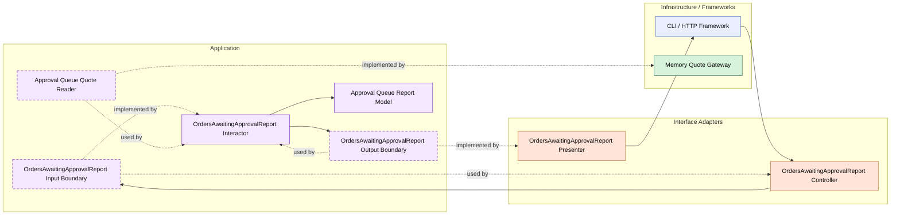

# Lesson 028: Orders Awaiting Approval Report

## Objective

Add an approval-queue style report that exposes pending approval work as an application-owned projection.

## Theory

The name "orders awaiting approval" is slightly imperfect in this Clean track.

The current model does not have a separate approval aggregate or an order that exists before quote approval.

What it does have is:

- quotes in `PendingApproval`

So the honest application projection is:

- an approval queue over pending-approval quotes

This is still a useful Clean Architecture lesson because it shows that reports do not need to mirror entity names mechanically.

The application layer can define a report in the language the business cares about, while still being explicit about which underlying model state it reads from.

The report answers:

- which approval items are waiting
- how many lines each has
- what the total quoted amount is

The tradeoff is that the lesson must be explicit about the modeling shortcut instead of hiding it.

## Why This Matters Here

The current reporting track already covers conversion, returns, and low stock.

This lesson adds a human workflow queue, which is a different class of read model:

- not a direct entity list
- not a pure metric
- not an infrastructure snapshot

That broadens the Clean reporting story without inventing domain structures the code does not actually have.

## Diagram

Legend:

- blue: framework edge
- green: data adapter
- orange: translation adapter
- purple: application layer
- dashed border: interface / contract
- dashed arrow: structural relationship such as `used by` or `implemented by`

## Implementation Focus

Add:

- `OrdersAwaitingApprovalReport`

The code should show:

- a queue-style projection over `PendingApproval` quotes
- total amount calculation inside the interactor
- a presenter shaping approval queue rows for callers

## What To Verify

- the project compiles
- `go test ./...` passes
- pending approval quotes appear in the queue
- line counts and total amounts are calculated correctly
