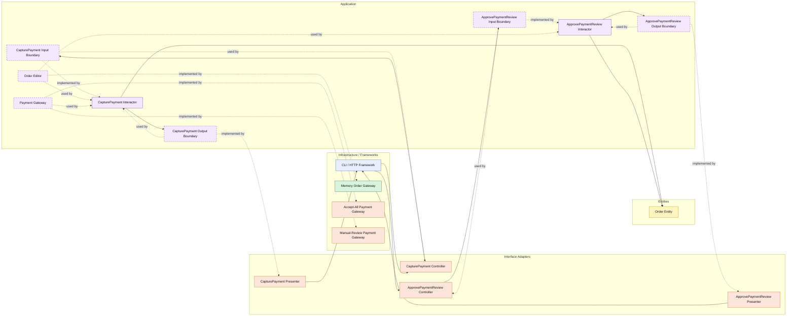

# Lesson 029: Payment Review Workflow

## Objective

Introduce a payment review state so payment capture can produce a business outcome other than immediate success.

## Theory

Until now, payment capture has been modeled as:

- success, or
- technical failure

That is often too narrow.

Real payment integrations may say:

- approve immediately
- send to manual review
- fail technically

The important point is that "manual review" is not just an error.

It is a business outcome that changes the workflow state.

Clean Architecture handles this by letting the application boundary own:

- the outcome contract returned by the payment gateway
- the workflow transition for `PaymentReview`
- the explicit command that approves a reviewed payment

The infrastructure layer only reports the capture outcome.

The application layer decides what that means for the order lifecycle.

## Why This Matters Here

This is a stronger lesson than another report or list query because it adds a genuinely new state boundary.

The order workflow is no longer linear:

- pending payment
- paid
- shipped

It now has a real branch:

- pending payment
- payment review
- paid
- shipped

That makes the Clean use cases more representative of real business processes and shows how an interactor can coordinate business-state transitions from an external outcome without leaking gateway details inward.

## Diagram

Legend:

- blue: framework edge
- green: data adapter
- orange: translation or service adapter
- purple: application layer
- yellow: entity layer
- dashed border: interface / contract
- dashed arrow: structural relationship such as `used by` or `implemented by`

## Implementation Focus

Add:

- `PaymentReview` as an order state
- payment capture outcomes for approved vs review
- `ApprovePaymentReview`

The code should show:

- the payment gateway returning a business outcome instead of only `error`
- capture moving some orders into `PaymentReview`
- shipment remaining blocked until review is approved

## What To Verify

- the project compiles
- `go test ./...` passes
- capture can move an order to `PaymentReview`
- approving payment review moves the order to `Paid`
- shipment is rejected while the order is still in review
