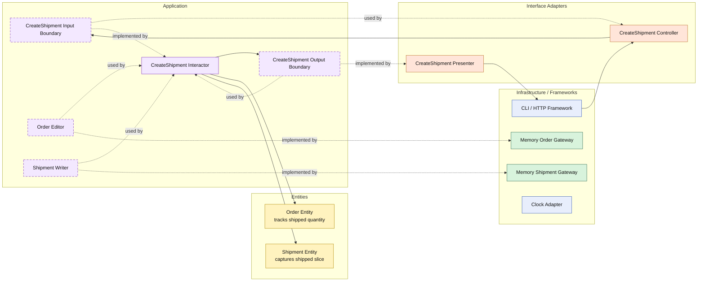

# Lesson 030: Partial Shipment Support

## Objective

Make fulfillment quantity-aware so an order can be shipped in multiple steps instead of only as an all-or-nothing transition.

## Theory

Up to this point, shipment creation has assumed a very simple rule:

- once an order is paid, one shipment ships everything

That is useful for early lessons, but too narrow for a realistic fulfillment workflow.

Real systems often need:

- a first shipment for available items
- later shipments for the remaining quantity

Clean Architecture handles this by keeping the fulfillment rule in the inner layers:

- the entity tracks shipped quantity per line
- the use case decides whether to ship explicit quantities or all remaining quantities
- the shipment entity captures only the shipped slice for that step

The important change is that the order lifecycle now has a meaningful intermediate state:

- `PartiallyShipped`

That state matters to the rest of the application.

For example:

- cancellation must now reject partially shipped orders too
- later fulfillment commands must be able to continue from partial state

## Why This Matters Here

The payment review lesson added a real branch before fulfillment.

This lesson does the same for fulfillment itself.

The shipping workflow is no longer a one-step state flip. It becomes incremental, and the entity now owns more of the fulfillment truth instead of the interactor treating shipping as a one-time event.

## Diagram

Legend:

- blue: framework edge
- green: data adapter
- orange: translation adapter
- purple: application layer
- yellow: entity layer
- dashed border: interface / contract
- dashed arrow: structural relationship such as `used by` or `implemented by`

## Implementation Focus

Add:

- `PartiallyShipped` order state
- shipped quantity tracking on order lines
- explicit shipment line input for partial shipment
- default "ship all remaining" behavior for the existing full-shipment path

The code should show:

- the entity updating shipment progress
- later shipments continuing from partial state
- cancellation treating partial shipment as already-fulfilled

## What To Verify

- the project compiles
- `go test ./...` passes
- a partial shipment stores only the requested quantity
- a later shipment can ship the remaining quantity
- partially shipped orders cannot be cancelled
