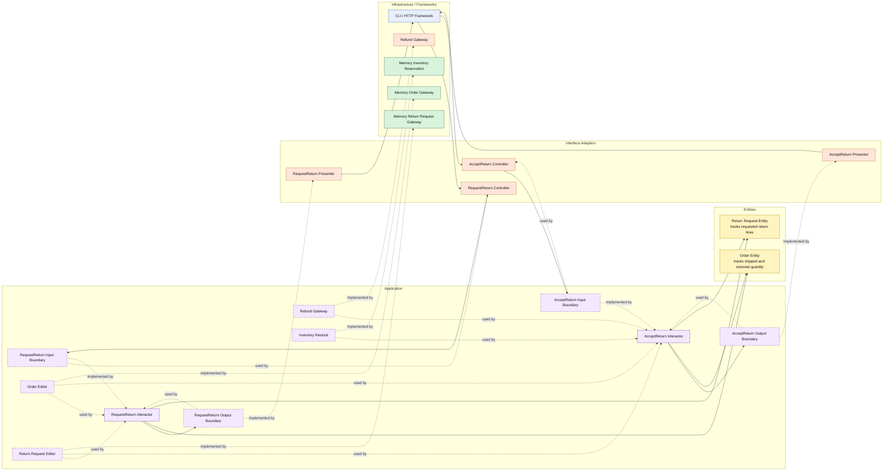

# Lesson 031: Partial Returns By Line

## Objective

Make returns quantity-aware so a return request can cover only some shipped units instead of always implying the whole order.

## Theory

Partial shipment support created an asymmetry:

- fulfillment can now happen in slices
- returns still behave like all shipped quantity must come back together

That is too coarse.

A realistic reverse flow often needs:

- return 1 of 3 shipped units
- return one SKU but not another
- make another return later for the remaining shipped quantity

Clean Architecture handles this by keeping the quantity rules in the inner layers:

- the request use case accepts explicit return lines
- the return request entity snapshots those lines
- the order entity tracks how much has already been returned
- acceptance updates order return progress and restocks only the accepted lines

The important change is that a return request is no longer just:

- order id
- reason

It is now also:

- the specific line quantities being returned

## Why This Matters Here

This is the natural counterpart to partial shipment.

Without it, the forward flow becomes more realistic while the reverse flow stays artificially simple.

This lesson brings the two halves back into alignment and makes the order entity carry more of the lifecycle truth around what has shipped versus what has been returned.

## Diagram

Legend:

- blue: framework edge
- green: data adapter
- orange: translation or service adapter
- purple: application layer
- yellow: entity layer
- dashed border: interface / contract
- dashed arrow: structural relationship such as `used by` or `implemented by`

## Implementation Focus

Add:

- explicit return line input
- return request line snapshots
- returned quantity tracking on order lines
- restock and return accounting based only on the accepted return lines

The code should show:

- requesting only some shipped quantity
- accepting a partial return updates order return progress
- later returns cannot exceed what has already shipped minus what was already returned

## What To Verify

- the project compiles
- `go test ./...` passes
- a partial return request stores only the requested line quantities
- accepting a partial return restocks only those quantities
- returned quantity on the order increases correctly
