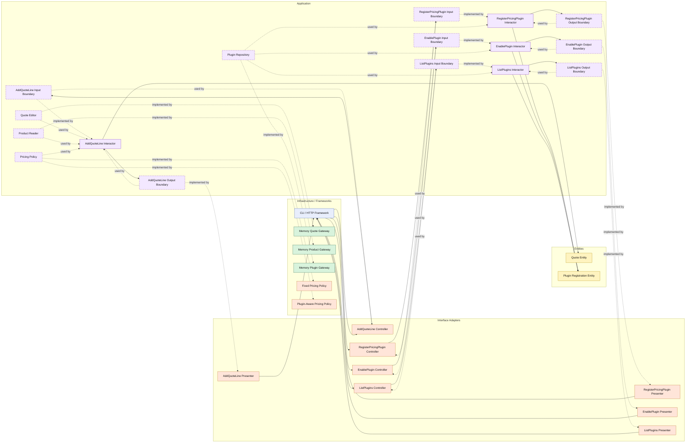

# Lesson 032: Plugin Pricing Extension Point

## Objective

Add a real extension seam so pricing behavior can change by enabling plugins without changing the quote workflow use case itself.

## Theory

Replaceability and extensibility are not the same thing.

Earlier Clean lessons already showed replaceable boundaries:

- approval policy
- payment gateway
- refund gateway

But a plugin extension point is a different architectural idea.

The question is no longer just:

- which one implementation do we inject?

It becomes:

- how does the application decide which optional behaviors are active?
- how can business behavior change without rewriting the core use case?

This lesson keeps the extension point deliberately narrow:

- quote line pricing

The shape is:

- the application owns plugin registration use cases
- infrastructure stores plugin registrations
- a plugin-aware pricing adapter composes enabled pricing plugins
- `AddQuoteLine` depends only on a pricing contract

That keeps the quote workflow stable while pricing behavior becomes extensible.

## Why This Matters Here

This is one of the strongest “why architecture matters” lessons in the Clean track.

Without an extension seam, every new pricing experiment would push more conditional logic into:

- `AddQuoteLine`
- `Quote`
- or some framework-specific service

With the seam, the use case keeps its orchestration role and the extension mechanism stays outside the entity model while still remaining explicit in the application layer.

## Diagram

Legend:

- blue: framework edge
- green: data adapter
- orange: service or translation adapter
- purple: application layer
- yellow: entity layer
- dashed border: interface / contract
- dashed arrow: structural relationship such as `used by` or `implemented by`

## Implementation Focus

Add:

- plugin registration, enable, and list use cases
- a plugin repository
- a pricing contract for `AddQuoteLine`
- a plugin-aware pricing adapter with one sample plugin: `seasonal-pricing`

The code should show:

- the quote use case stays stable
- pricing changes only because the enabled plugin set changes
- plugin registration and activation are application behavior, not framework magic

## What To Verify

- the project compiles
- `go test ./...` passes
- a pricing plugin can be registered and enabled
- enabling `seasonal-pricing` changes the quote line unit price and total
