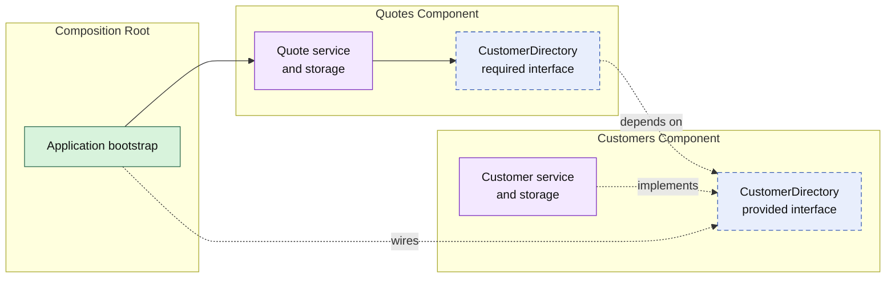

# Lesson 000: From Microkernel To Component-Based Architecture

## Objective

Explain how Component-Based Architecture differs from Microkernel / Plugin Architecture, where the two overlap, and why Component-Based Architecture is worth studying next.

## Short Answer

Both architectures divide one application into replaceable units with explicit contracts. The difference is the organizing center.

Microkernel Architecture asks:

- what is the stable kernel?
- which capabilities should grow as plugins around it?
- how are those capabilities registered and discovered?

Component-Based Architecture asks:

- what cohesive components make up the application?
- which interfaces does each component provide and require?
- how can components be assembled without knowing each other's internals?

So this is not simply Microkernel with the word "plugin" replaced by "component." Component-Based Architecture removes the privileged kernel-and-plugin relationship and makes peer component contracts the main design tool.

## Theory

A component is a cohesive, independently understandable part of the application that owns its implementation details and exposes a small public interface. Other components should depend on that interface, not on the component's storage, types, or internal services.

The architecture solves a common monolith problem:

- packages may be separated physically
- but any package can still reach into another package's implementation
- the resulting coupling makes replacement, testing, and ownership harder

Component boundaries make those dependencies deliberate. A composition root wires concrete components together; the components themselves collaborate through their required and provided interfaces.

The tradeoff is indirection. Stable contracts and explicit assembly improve isolation, but they require more design than direct package calls.

## Why This Matters Here

The Microkernel track made extension points explicit through a kernel that registered and resolved plugins. That was the right shape when optional capability growth was the main concern.

This track will make a different concern visible:

- `Customers` can provide an active-customer check
- `Quotes` can require that check while owning quote creation
- neither component owns a global registry or reaches into the other's repository
- the application entry point composes the concrete components

This gives business capabilities a peer relationship. A component can be replaced or tested through its contract without first becoming a plugin or passing through a central kernel.

## Diagram

Legend:

- purple: component-owned implementation
- blue dashed: provided or required interface
- green: composition edge
- solid arrows: runtime calls
- dashed arrows: wiring or structural relationships

## Comparison With The Previous Architectures

These architectures are not mutually exclusive: a component can have layers, use ports, or contain a rich domain model. The comparison shows what each architecture makes *primary*—the boundary it asks the team to protect first. Component-Based Architecture shifts the center of mass from layers, rings, modules, or a kernel to cohesive peer components and the contracts used to assemble them.

| Architecture | Center of mass | Main boundary and interface style | Data ownership | What it separates—and what it may mix | Main strength | Typical weak point |
| --- | --- | --- | --- | --- | --- | --- |
| Layered | Technical layers | Presentation → application → domain → infrastructure; interfaces are optional and often internal | Data access usually sits in infrastructure and may be shared by application services | Separates technical responsibilities; business capabilities can still spread across layers | Simple, familiar request flow | Layers can become broad buckets; capability ownership is weak |
| Hexagonal / Ports and Adapters | The application core | Ports are owned by the core; adapters implement inbound or outbound ports | The core defines persistence needs; adapters own storage details | Separates core behavior from delivery mechanisms and external systems; core use cases can still be grouped broadly | Testable core with replaceable adapters | Extra abstractions can be unnecessary for simple in-process collaboration |
| Clean | Use cases and dependency rule | Dependencies point inward; use-case boundaries and gateway interfaces protect policies | Entities and use cases own rules; outer adapters own persistence and frameworks | Separates enterprise rules, application rules, and details; business capabilities may cross use-case packages | Strong protection from framework and database coupling | Can become ceremony-heavy or over-abstracted |
| Onion | Domain model at the center | Concentric rings; outer layers depend inward on domain and application contracts | Domain owns business meaning; repositories and infrastructure stay at the edge | Separates domain logic from infrastructure; module ownership is not necessarily explicit | Keeps the domain central and durable | Ring placement can overshadow collaboration between business areas |
| Modular Monolith | Business modules | Narrow module APIs; modules collaborate without exposing internals | Each module should own its state and storage access | Separates business capabilities inside one deployable; modules may still use direct, compile-time collaboration | Strong business ownership without distributed-system cost | Boundaries rely on discipline and can erode into a shared monolith |
| Microkernel / Plugin | Stable kernel and extension points | Kernel-owned capability contracts; plugins register, publish, and resolve capabilities | Plugins own their internals; the kernel coordinates capabilities rather than business data | Separates stable core from optional or replaceable extensions; plugin lifecycle and contracts become shared concerns | Makes extensibility and replacement explicit | Kernel contract sprawl and plugin indirection can become a new center of gravity |
| Component-Based | Cohesive peer components | Provided and required interfaces; a composition root wires compatible components | Each component owns its data and implementation; consumers see only its contract | Separates independently understandable components from their internals; composition is centralized rather than discovery-driven | Clear replacement, testing, and ownership at business boundaries | Contract design and dependency management can become indirect or fragmented |

## How It Differs From Microkernel

Microkernel has an asymmetric structure:

- a stable kernel owns extension contracts and capability discovery
- plugins grow around that kernel

Component-Based Architecture is more symmetric:

- a component provides one or more interfaces
- another component declares the interfaces it requires
- a composition root connects compatible components

The key question therefore changes from:

> Should this behavior be published as a kernel capability and implemented by a plugin?

to:

> Which component owns this behavior, and what is the smallest interface another component needs from it?

## What Component-Based Architecture Solves Better

### 1. Peer Collaboration Without A Central Registry

Not every application needs plugin discovery. Components can be wired explicitly at startup, which makes dependencies easy to trace and keeps a central kernel from becoming a crowded contract hub.

### 2. Replacement At A Business Boundary

A component's internal storage or implementation can change as long as its provided interface remains compatible. Consumers are protected from that internal change.

### 3. Clearer Ownership In A Monolith

Components make it natural to ask who owns a capability, its data, and its public contract. That improves local reasoning without requiring separate deployment.

## What Microkernel Still Does Better

Microkernel remains the clearer choice when the main concern is runtime extension:

- optional plugins
- registration and discovery
- replaceable behavior selected through a kernel-owned extension point
- decoration chains such as the seasonal pricing plugin

Component-Based Architecture can support replaceability, but it does not make dynamic plugin discovery its central story.

## What Will Change In The Upcoming Lessons

The first runnable lesson will introduce a small composition with two components:

- a `customers` component that provides customer validation
- a `quotes` component that requires that validation to create a draft quote
- a composition root that supplies concrete implementations

Later lessons can grow the system by adding components and contracts while keeping implementations private to their owners.

## Implementation Focus

This is a transition lesson only. It establishes the vocabulary and boundary rules for the upcoming runnable skeleton; it deliberately adds no application code yet.

## What To Verify

- the difference between a component contract and a kernel capability is clear
- the composition root, rather than a component, owns concrete wiring
- a component consumer depends on a provided interface, not another component's storage or internal services
- the upcoming skeleton can begin with only the `customers` and `quotes` components
