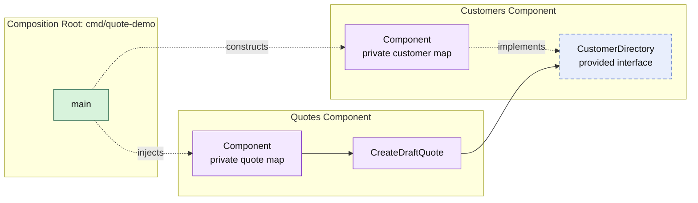

# Lesson 001: Component Skeleton

## Objective

Build the first runnable Component-Based Architecture slice: a `customers` component that provides active-customer validation and a `quotes` component that requires it before creating a draft quote.

## Theory

Component-Based Architecture organizes the application around cohesive units that own both their implementation and their data. A component exposes only the operations another component needs; it does not expose its storage or internal services.

The connection between components is explicit:

- `customers` publishes the `CustomerDirectory` interface
- `quotes` receives that interface when it is constructed
- the composition root selects the concrete `customers` component and wires it into `quotes`

This prevents `quotes` from reaching into customer records directly. The tradeoff is that the constructor and public contract must be designed deliberately, instead of simply importing another component's internals.

## Why This Matters Here

Creating a draft quote needs one fact from the customer capability: whether the customer is active. It does not need customer storage, a customer repository, or the entire customer component API.

The `CustomerDirectory` interface makes that minimum dependency visible. `customers` remains free to change how it stores customers, while `quotes` remains testable with a small substitute for the provided contract.

## Diagram

Legend:

- purple: component-owned implementation
- blue dashed: component contract
- green: composition edge
- solid arrow: runtime call
- dashed arrow: construction, injection, or implementation relationship

## Implementation Focus

Implement only:

- an in-memory `customers` component with customer registration and the `CustomerDirectory` contract
- an in-memory `quotes` component that creates draft quotes through that contract
- a CLI composition root that wires the two components
- tests proving that active customers can receive draft quotes and inactive customers cannot

Leave quote lines, approvals, repositories, external adapters, and additional components for later lessons.

## What To Verify

- `go test ./...` passes from `component-based-architecture/`
- the CLI creates a draft quote for an active customer
- `quotes` imports only the public `customers` contract, not customer storage
- the concrete components are wired only by `cmd/quote-demo/main.go`
