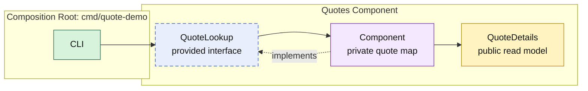

# Lesson 002: Quote Query Through A Provided Contract

## Objective

Add the first read flow to the Quotes component by publishing a narrow `QuoteLookup` contract and returning a read model instead of its internal `Quote` state.

## Theory

A component boundary applies to reads as well as writes. If another component or entrypoint receives the Quotes component's map—or even its internal `Quote` type—it becomes coupled to implementation details that the component should own.

Instead, the Quotes component provides `QuoteLookup`:

- callers ask for a quote by identifier
- the component chooses how it finds and stores the quote
- callers receive `QuoteDetails`, a read model that belongs to the public contract

This makes the component replaceable without making its data structure part of the application-wide model. The tradeoff is deliberate mapping: public read models can duplicate a small amount of internal state.

## Why This Matters Here

Lesson 001 established a *required* contract: Quotes needs `customers.CustomerDirectory`.

This lesson establishes a *provided* contract: Quotes offers `QuoteLookup` to future components. The CLI uses it now, but a future Orders component could receive the same interface without learning how Quotes stores records.

## Diagram

Legend:

- purple: component-owned implementation
- blue dashed: provided contract
- yellow: public read model
- green: composition edge
- solid arrows: runtime flow
- dashed arrow: implementation relationship

## Implementation Focus

Implement only:

- `QuoteLookup`, a public Quotes-component contract
- `GetQuote`, which reads from the component's private in-memory state
- `QuoteDetails`, the read model returned by the contract
- a CLI query after draft-quote creation
- tests for successful lookup and a missing quote

Do not add quote lists, quote lines, order consumption, or a repository abstraction yet.

## What To Verify

- `go test ./...` passes from `component-based-architecture/`
- the demo creates and then loads a draft quote
- callers receive `QuoteDetails`, not the component's internal map
- `Component` satisfies the `QuoteLookup` contract
