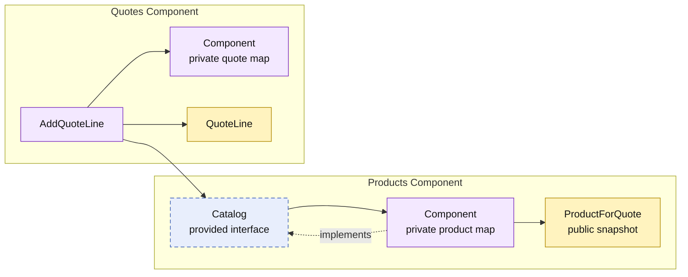

# Lesson 003: Add A Quote Line With A Product Contract

## Objective

Add the first multi-component update flow: the Products component provides a sellable-product contract, and the Quotes component uses it to add a line to a draft quote it owns.

## Theory

Components should collaborate through the smallest information contract that supports the workflow. Quotes needs a product snapshot suitable for quoting; it does not need Products' map, registration API, or internal product representation.

This lesson introduces `products.Catalog` as a provided contract. The Quotes component receives it during composition and uses it to:

1. load the quote it owns;
2. request a sellable product snapshot;
3. add a product-derived line to the quote it owns; and
4. save the updated quote in its private state.

The component boundary keeps data ownership clear: Products decides whether a product is sellable; Quotes decides whether and how that snapshot can become a quote line. The tradeoff is that the product snapshot is deliberately copied across the contract rather than shared as mutable state.

## Why This Matters Here

The first two lessons established one required contract (`CustomerDirectory`) and one provided contract (`QuoteLookup`). This is the first workflow where Quotes both consumes another component's contract and changes its own state.

It demonstrates that component collaboration is not only for lookups. A component can use another component's published capability while keeping the state transition inside its own boundary.

## Diagram

Legend:

- purple: component-owned implementation
- blue dashed: provided contract
- yellow: data crossing or belonging to a component boundary
- solid arrows: runtime flow
- dashed arrow: implementation relationship

## Implementation Focus

Implement only:

- a Products component with private in-memory product state
- `products.Catalog`, returning `ProductForQuote` for active products
- `AddQuoteLine` in the Quotes component
- a quote read model with `LineCount`
- a demo and tests proving that an active product can be added to a draft quote

Leave pricing policies, approvals, quote submission, product queries, and inventory for later lessons.

## What To Verify

- `go test ./...` passes from `component-based-architecture/`
- the demo creates a draft quote, adds one line, and loads it again
- Quotes depends on `products.Catalog`, not on product storage
- product data crosses the boundary as a `ProductForQuote` snapshot
