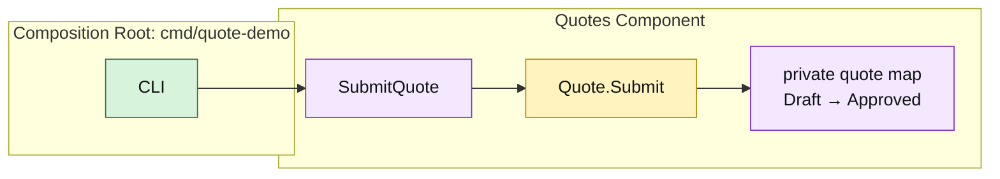

# Lesson 004: Submit Quote State Transition

## Objective

Make quote submission an explicit lifecycle transition owned by the Quotes component, so callers cannot decide for themselves whether a quote is ready to submit.

## Theory

Component boundaries protect behavior as well as data. The Quotes component already owns the private quote map; it must also own the rules that decide whether a quote can move from draft to submitted.

In this lesson, `Quote.Submit` enforces three rules:

- only draft quotes can be submitted;
- a quote must contain at least one line; and
- a successfully submitted quote becomes `Approved` in this simple flow.

`Component.SubmitQuote` loads the owned quote, asks the quote to make the transition, and stores the result back in the component's private state. The CLI invokes the component operation but does not reproduce any lifecycle rules.

The tradeoff is intentional centralization: changing a lifecycle rule requires changing the Quotes component, but that is safer than allowing each caller to interpret quote status independently.

## Why This Matters Here

The Products contract supplies data for the previous lesson, but product lookup must not decide quote lifecycle. That decision belongs to the component that owns quotes.

This distinction keeps the collaboration clear:

- Products provides sellable product snapshots.
- Quotes owns lines, status, and submission rules.
- The composition root only invokes the workflow.

## Diagram

Legend:

- purple: component-owned operation or state
- yellow: quote lifecycle behavior
- green: composition edge
- solid arrows: runtime flow

## Implementation Focus

Implement only:

- the `Quote.Submit` lifecycle rule
- `SubmitQuote` on the Quotes component
- an updated quote read model that exposes the submitted status
- tests for valid submission, empty quotes, and post-submission editing
- a demo that creates, adds a line, submits, and loads a quote

Leave approval policies, rejection, order conversion, and payment handling for later lessons.

## What To Verify

- `go test ./...` passes from `component-based-architecture/`
- a draft quote with lines becomes `Approved`
- an empty quote cannot be submitted
- an approved quote cannot receive another line
