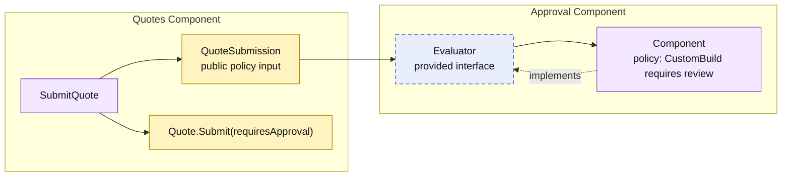

# Lesson 005: Approval Policy Component

## Objective

Introduce an Approval component that provides a policy contract to Quotes, so submission can distinguish automatically approved quotes from quotes awaiting review.

## Theory

The Quotes component owns the lifecycle transition, but it should not necessarily own every business policy that selects a transition path. Approval criteria can change independently from the basic rule that only a draft quote with lines may be submitted.

Component-Based Architecture separates those responsibilities through a required contract:

- the Approval component provides `Evaluator`;
- Quotes supplies a small `QuoteSubmission` snapshot to that contract;
- Quotes still performs the state transition based on the decision it receives.

The contract carries category information, not Quotes' private `Quote` object. This lets Approval evolve its decision logic without gaining access to quote storage, while Quotes remains responsible for changing quote state.

The tradeoff is a new boundary and data-mapping step. That cost is worthwhile only when approval policy is a meaningful, independently changing concern.

## Why This Matters Here

Without this component, Quotes would need to hard-code category-specific approval rules. Then every policy change would require changing the quote lifecycle implementation.

With the boundary:

- Products owns product categories.
- Approval owns the policy that interprets categories.
- Quotes owns the `Draft → Approved` or `Draft → PendingApproval` transition.

No component needs to expose its internal map or entity to make the workflow work.

## Diagram

Legend:

- purple: component-owned behavior
- blue dashed: provided contract
- yellow: data crossing a component boundary or quote behavior
- solid arrows: runtime flow
- dashed arrow: implementation relationship

## Implementation Focus

Implement only:

- an Approval component that requires review for `CustomBuild` product lines
- `approvals.Evaluator` and its `QuoteSubmission` input model
- category data in the Products-to-Quotes snapshot
- policy-aware quote submission producing `Approved` or `PendingApproval`
- tests for both paths

Leave manual approval, rejection, configurable policy rules, and order conversion for later lessons.

## What To Verify

- `go test ./...` passes from `component-based-architecture/`
- a standard-product quote becomes `Approved`
- a custom-build quote becomes `PendingApproval`
- Quotes depends on the Approval contract, not its implementation or policy details
