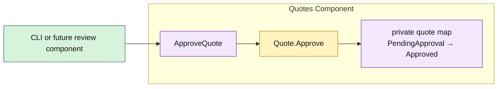

# Lesson 006: Approve A Pending Quote

## Objective

Complete the pending-approval workflow by adding an explicit quote-approval operation that moves a `PendingApproval` quote to `Approved`.

## Theory

The Approval component decides whether a submitted quote needs review. It does not perform the review action or own quote state. Those remain responsibilities of the Quotes component.

This lesson adds a second lifecycle transition:

- the Approval component evaluates submission policy;
- Quotes moves a custom-build quote from `Draft` to `PendingApproval` during submission;
- `Quote.Approve` permits only a pending quote to move to `Approved`.

Keeping the action in Quotes prevents an approval caller from setting a status directly. The caller can request approval, but the component that owns the quote validates and applies the transition.

## Why This Matters Here

`PendingApproval` becomes meaningful only when it has a constrained next step. Otherwise it is merely a value that callers could bypass or overwrite.

The separation is now precise:

- Approval owns *whether review is required*.
- Quotes owns *whether approval is currently valid* and the resulting state change.
- The composition root invokes the workflow without accessing quote state.

## Diagram

Legend:

- purple: component-owned operation or state
- yellow: quote lifecycle behavior
- green: caller at the composition edge
- solid arrows: runtime flow

## Implementation Focus

Implement only:

- `Quote.Approve`, valid only from `PendingApproval`
- `ApproveQuote` on the Quotes component
- tests for valid approval and invalid repeat approval
- a demo branch that submits a custom-build quote and approves it

Leave reviewer identity, rejection, approval queues, and audit history for later lessons.

## What To Verify

- `go test ./...` passes from `component-based-architecture/`
- a pending custom-build quote becomes `Approved`
- an already approved quote cannot be approved again
- callers cannot mutate quote status directly
