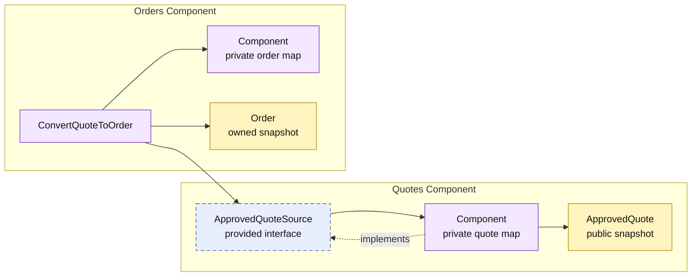

# Lesson 007: Convert An Approved Quote To An Order

## Objective

Introduce the Orders component and convert an approved quote into an order through a narrow contract provided by the Quotes component.

## Theory

Component-Based Architecture does not require a consumer to depend on the whole provider component. Orders needs only one capability from Quotes: an approved quote snapshot that is valid for conversion.

Quotes therefore provides `ApprovedQuoteSource`:

- Quotes validates that its private quote is approved.
- Quotes maps the private quote into an `ApprovedQuote` snapshot.
- Orders receives that snapshot, copies it into an order it owns, and stores the order in its own private state.

This keeps both ownership boundaries intact. Orders does not read the Quotes component's map or decide whether a quote is convertible; Quotes does not create or store orders.

The tradeoff is explicit data duplication. Once conversion succeeds, an order intentionally captures its own business snapshot rather than retaining a mutable reference to the quote.

## Why This Matters Here

The earlier lessons connected components by policy and catalog contracts. This lesson adds a component that consumes another component's business document as a workflow input.

The boundary answers three questions clearly:

- Quotes owns quote lifecycle and conversion eligibility.
- Orders owns order creation and order state.
- The composition root wires Orders to the narrow Quotes contract.

## Diagram

Legend:

- purple: component-owned behavior or state
- blue dashed: provided contract
- yellow: snapshot crossing or created at a boundary
- solid arrows: runtime flow
- dashed arrow: implementation relationship

## Implementation Focus

Implement only:

- the Quotes-provided `ApprovedQuoteSource` contract and conversion snapshot
- an Orders component with private in-memory order state
- `ConvertQuoteToOrder` in Orders
- tests for approved and non-approved quote conversion
- a demo that converts an approved custom-build quote

Leave inventory reservation, payment, order queries, and shipment for later lessons.

## What To Verify

- `go test ./...` passes from `component-based-architecture/`
- an approved quote converts to an order with `PendingPayment` status
- a pending quote cannot be converted
- Orders depends on `ApprovedQuoteSource`, not quote storage
