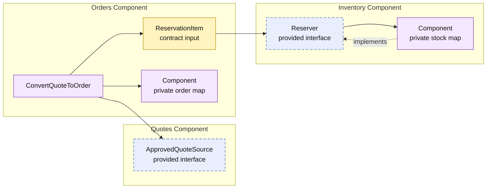

# Lesson 008: Order Conversion With Inventory Reservation

## Objective

Extend quote-to-order conversion so the Orders component reserves stock through a contract provided by a new Inventory component before creating the order.

## Theory

Order conversion has an operational consequence: accepting an approved quote must claim the required stock. That consequence belongs to Inventory, not Orders.

The Orders component therefore requires `inventory.Reserver`:

1. Orders requests an approved-quote snapshot from Quotes.
2. Orders maps the quote lines into reservation items.
3. Inventory validates and reserves its private stock state.
4. Only after reservation succeeds does Orders create and store its private order snapshot.

Each component retains ownership of its own state. Orders never changes stock records directly, and Inventory never creates orders. The tradeoff is workflow coordination: Orders must translate its order intent into the inventory contract's small input model.

## Why This Matters Here

This is the first component with two required contracts in one workflow:

- Quotes provides conversion-ready quote data.
- Inventory provides stock reservation.
- Orders coordinates both requirements while owning the result.

The composition root wires all three concrete components, but the Orders implementation sees only their contracts.

## Diagram

Legend:

- purple: component-owned behavior or state
- blue dashed: provided contract
- yellow: contract input data
- solid arrows: runtime flow
- dashed arrow: implementation relationship

## Implementation Focus

Implement only:

- an Inventory component with private in-memory stock
- `inventory.Reserver` and `ReservationItem`
- reservation during `ConvertQuoteToOrder`
- tests for successful reservation and insufficient stock
- demo stock registration before conversion

Leave reservation release, stock queries, payment, and shipment for later lessons.

## What To Verify

- `go test ./...` passes from `component-based-architecture/`
- conversion reserves stock before an order is created
- insufficient stock stops conversion
- Orders depends on `Reserver`, not Inventory's stock map
