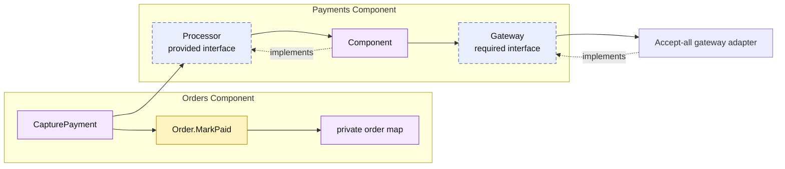

# Lesson 009: Payment Capture Through The Payments Component

## Objective

Add payment capture for pending-payment orders while keeping the payment gateway behind a Payments component contract.

## Theory

Orders owns order lifecycle, but it should not know how an external payment gateway is called. Payments owns that integration concern and provides a narrow `Processor` contract to Orders.

The dependency chain is deliberate:

1. Orders maps its private order state into a `PaymentRequest`.
2. Orders calls the Payments component through `Processor`.
3. The Payments component delegates to its internally configured `Gateway`.
4. Orders validates and applies the `PendingPayment → Paid` transition to its own order.

The composition root selects the concrete gateway adapter. Orders sees neither the adapter nor its gateway-specific API. The tradeoff is an additional component and contract around a simple call, which becomes valuable when gateway details, retries, or alternative providers evolve.

## Why This Matters Here

Payment capture is an external integration, not an order-storage concern. Keeping it outside Orders means that Orders can retain one clear responsibility: whether an order can be paid and what status follows a successful capture.

The ownership split is:

- Orders owns payment eligibility and order status.
- Payments owns the payment-processing capability.
- The gateway adapter owns the provider-specific call.

## Diagram

Legend:

- purple: component-owned behavior or state
- blue dashed: contract
- yellow: order lifecycle behavior
- solid arrows: runtime flow
- dashed arrow: implementation relationship

## Implementation Focus

Implement only:

- the Payments component's `Processor` and internal `Gateway` contract
- an accept-all gateway adapter wired by the composition root
- `CapturePayment` on Orders
- the `PendingPayment → Paid` order transition
- tests for valid capture and repeated capture rejection

Leave payment review, refunds, gateway retries, and payment persistence for later lessons.

## What To Verify

- `go test ./...` passes from `component-based-architecture/`
- only pending-payment orders can be captured
- successful capture changes order status to `Paid`
- Orders depends on `payments.Processor`, not the gateway adapter
