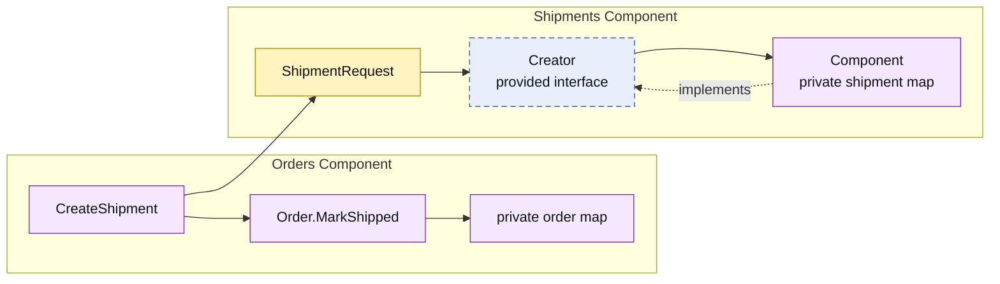

# Lesson 010: Shipment Creation After Payment

## Objective

Add a Shipments component and create a shipment for a paid order through its provided contract, while Orders retains ownership of the resulting order-state transition.

## Theory

A shipment is a distinct business artifact. Although Orders coordinates fulfillment, it should not absorb shipment storage or identifier creation.

The Shipments component provides `Creator`:

1. Orders validates that its private order is paid.
2. Orders maps order lines into a `ShipmentRequest`.
3. Shipments creates and stores a private shipment record.
4. Orders marks its own order as shipped only after shipment creation succeeds.

The components collaborate through a small request and result model. Orders never accesses shipment storage, and Shipments does not change order status. The tradeoff is an orchestration boundary that must be kept consistent if shipment creation succeeds but later order persistence fails; this in-memory lesson has no persistence failure path yet.

## Why This Matters Here

The workflow now has a clear fulfillment split:

- Payments confirms capture.
- Shipments owns shipment records.
- Orders decides whether an order may be shipped and records that lifecycle state.

This prevents the common shortcut of treating shipment data as just another field inside the Orders component.

## Diagram

Legend:

- purple: component-owned behavior or state
- blue dashed: provided contract
- yellow: data crossing a component boundary
- solid arrows: runtime flow
- dashed arrow: implementation relationship

## Implementation Focus

Implement only:

- the Shipments component with private in-memory shipment state
- `shipments.Creator` and `ShipmentRequest`
- `CreateShipment` in Orders for fully shipping a paid order
- the `Paid → Shipped` order transition
- tests and a demo shipment after payment capture

Leave partial shipment, carrier integration, tracking, and shipment queries for later lessons.

## What To Verify

- `go test ./...` passes from `component-based-architecture/`
- only paid orders can be shipped
- successful shipment creation marks the order `Shipped`
- Orders depends on `shipments.Creator`, not shipment storage
