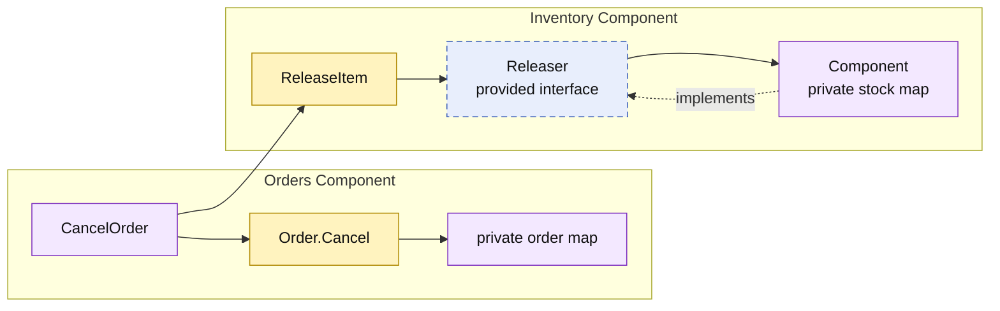

# Lesson 011: Order Cancellation And Inventory Release

## Objective

Add the first reverse order workflow: cancel an unshipped order and release its previously reserved stock through the Inventory component.

## Theory

Forward workflows reserve stock during order conversion. A correct reverse workflow must undo that reservation without letting Orders manipulate stock directly.

The Inventory component now provides `Releaser` alongside `Reserver`. Orders uses their combined `StockKeeper` contract:

1. Orders validates that its private order has not shipped.
2. Orders transitions the order to `Cancelled`.
3. Orders maps its lines into inventory release items.
4. Inventory restores its private stock state.

The cancellation rule belongs to Orders; the stock arithmetic belongs to Inventory. The tradeoff is a cross-component consistency concern: a real persistent implementation would need to handle a release failure after cancellation. The in-memory implementation keeps the order unchanged until release succeeds.

## Why This Matters Here

This is the first workflow that reverses a previous component collaboration:

- Orders originally requested stock reservation.
- Inventory was the only owner of stock state.
- Cancellation requests release through Inventory's public contract.

The same boundaries remain valid in both directions, which is the point of explicit component contracts.

## Diagram

Legend:

- purple: component-owned behavior or state
- blue dashed: provided contract
- yellow: lifecycle behavior or contract input
- solid arrows: runtime flow
- dashed arrow: implementation relationship

## Implementation Focus

Implement only:

- `inventory.Releaser`, `ReleaseItem`, and stock release
- `Order.Cancel`, valid only before shipment
- `CancelOrder` in Orders
- tests for successful release and rejection of shipped orders
- a demo cancellation of a newly converted order

Leave refunds, partial shipment cancellation, and cancellation reasons for later lessons.

## What To Verify

- `go test ./...` passes from `component-based-architecture/`
- cancellation releases the reserved quantities
- shipped orders cannot be cancelled
- Orders depends on the Inventory contract, not stock state
