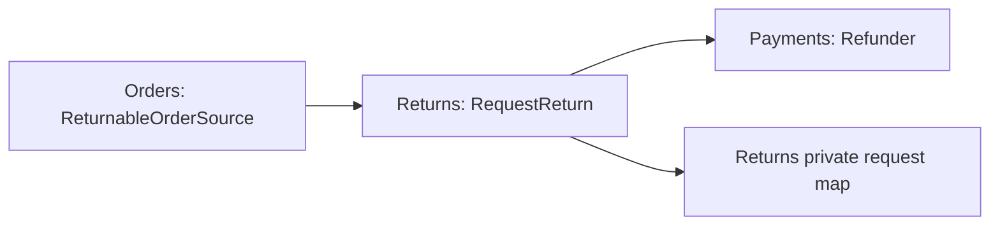

# Lesson 012: Return Request And Refund Boundary

## Objective

Add a Returns component that requests a return for a shipped order and issues its refund through the Payments component.

## Theory

Cancellation reverses work before shipment. A shipped order follows a different workflow: Orders decides whether the order is returnable, Returns owns the return record, and Payments owns the refund capability.

Returns consumes two narrow contracts: `orders.ReturnableOrderSource` supplies a shipped-order snapshot, while `payments.Refunder` executes the refund. Returns maps those inputs into a return request stored in its own private state. No component exposes its internal maps.

## Why This Matters Here

This makes post-shipment reversal distinct from cancellation: shipped orders cannot be cancelled, but they can be returned through a separate component boundary.

## Diagram

## Implementation Focus

- provide a returnable-order snapshot from Orders
- add the Returns component and its private return-request state
- request a refund through Payments for a shipped order
- reject a return request for a non-shipped order

## What To Verify

- `go test ./...` passes
- a shipped order creates a refunded return request
- a non-shipped order is rejected
