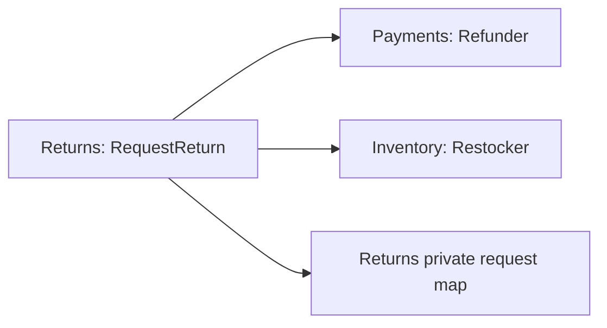

# Lesson 013: Return Restocking Boundary

## Objective

Restock inventory when Returns refunds a shipped-order return.

## Theory

Returns coordinates the post-shipment workflow, but Inventory remains the owner of stock state. Returns now consumes `inventory.Restocker` after refunding payment and maps returned order lines into `RestockItem` values.

## Diagram

## Implementation Focus

- add Inventory's restock contract
- restock every returned order line after refund
- keep stock arithmetic inside Inventory

## What To Verify

- `go test ./...` passes
- a successful return triggers both refund and restock
