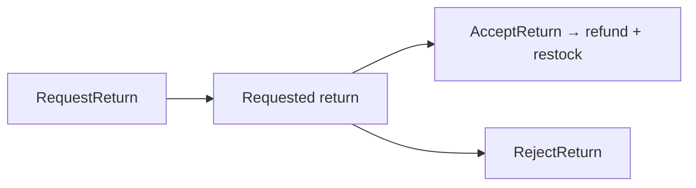

# Lesson 014: Return Review Boundary

## Objective

Split return requests from their review so refunds and restocking occur only when Returns accepts a requested return.

## Theory

Returns owns the request lifecycle. A request is first stored as `Requested`; a later acceptance calls Payments and Inventory, while rejection ends the request without either side effect.

## Diagram

## Implementation Focus

- requested, refunded, and rejected states
- separate request, accept, and reject operations
- refund and restock only on acceptance

## What To Verify

- `go test ./...` passes
- request creation has no financial or stock side effects
