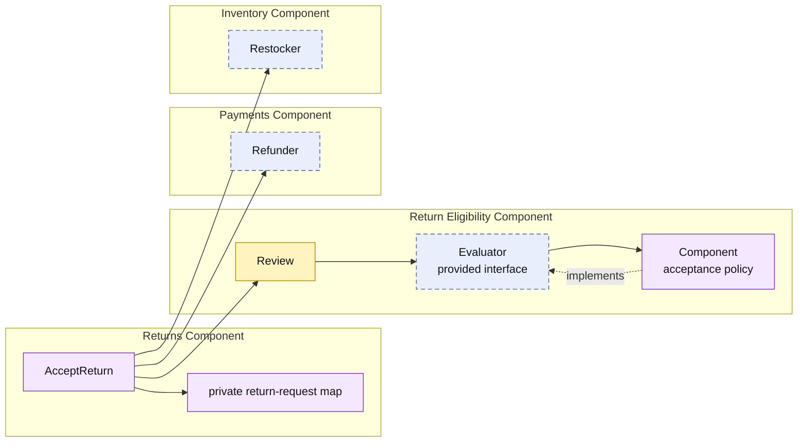

# Lesson 015: Return Eligibility Component

## Objective

Make return acceptance policy-aware by moving the acceptance rule into a dedicated Return Eligibility component.

## Theory

Lesson `014` introduced a review workflow: request, accept, or reject a return. Acceptance was still unconditional, so the Returns component mixed lifecycle orchestration with the rule that decides whether a request may be accepted.

This lesson separates those responsibilities:

- Returns owns return-request state and the review workflow.
- Return Eligibility owns the acceptance decision through its provided `Evaluator` contract.
- Payments and Inventory still own refunding and restocking after an allowed acceptance.

The component boundary adds a small mapping step, but keeps a changing policy from leaking into return storage and workflow code. The initial rule is intentionally a placeholder: a request with reason `outside return window` is rejected. A later lesson can replace it with a real date-based policy.

## Why This Matters Here

Returns should not have to change every time the acceptance criteria change. By sharing only a `returneligibility.Review` snapshot, Returns keeps its request map private and Return Eligibility remains free of workflow side effects.

## Diagram

Legend:

- purple: component-owned behavior or private state
- blue dashed: provided contract
- yellow: data crossing a component boundary
- solid arrows: runtime flow
- dashed arrow: implementation relationship

## Implementation Focus

Implement only:

- `returneligibility.Evaluator` and its small `Review` input model
- a Return Eligibility component with the temporary outside-window rule
- an eligibility check in `returns.AcceptReturn` before refund and restock
- automatic rejection with no side effects when policy blocks a request
- tests for the allowed and blocked paths

Leave real return-window timing, actor metadata, idempotency, and partial returns for later lessons.

## What To Verify

- `go test ./...` passes from `component-based-architecture/`
- eligible returns refund and restock
- a policy-blocked return is rejected
- a blocked return has no refund or restocking side effects
