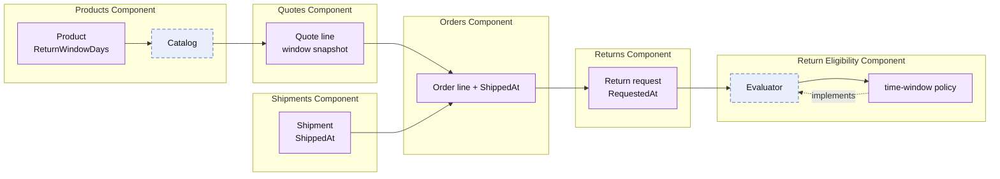

# Lesson 016: Real Return Window Policy

## Objective

Replace the placeholder return-eligibility rule with a time-based return-window policy that uses shipment timestamps and per-product window snapshots.

## Theory

Lesson `015` separated return acceptance policy from the Returns workflow, but its rule was only a placeholder. A real return decision needs business facts: when the order shipped, when the customer requested the return, and the return window that applied to each purchased product.

This lesson carries those facts across the existing component contracts. Products defines `ReturnWindowDays`; Quotes snapshots it into the approved-quote contract; Orders preserves it with the order and receives the shipment timestamp; Returns records its request timestamp and asks Return Eligibility to evaluate the resulting review snapshot.

The tradeoff is broader data propagation across component contracts. That cost protects the decision from later catalog changes and keeps the policy component independent of other components' private state.

## Why This Matters Here

Return Eligibility needs truthful historical inputs, not a reason-string convention. Each component still owns its own state and behavior, while the small values that cross boundaries make the actual policy possible.

## Diagram

Legend:

- purple: component-owned state or behavior
- blue dashed: provided contract
- solid arrows: runtime data flow
- dashed arrow: implementation relationship

## Implementation Focus

Implement only:

- `ReturnWindowDays` snapshots from Products through Quotes and Orders
- timestamped shipment and return-request records using a clock component contract
- real in-window and out-of-window evaluation in Return Eligibility
- tests for both policy outcomes

Leave per-line partial returns, actor metadata, idempotency, and configurable policy administration for later lessons.

## What To Verify

- `go test ./...` passes from `component-based-architecture/`
- an in-window return refunds and restocks
- an out-of-window return is rejected without side effects
- the policy is driven by timestamps and line snapshots, not by the return reason
