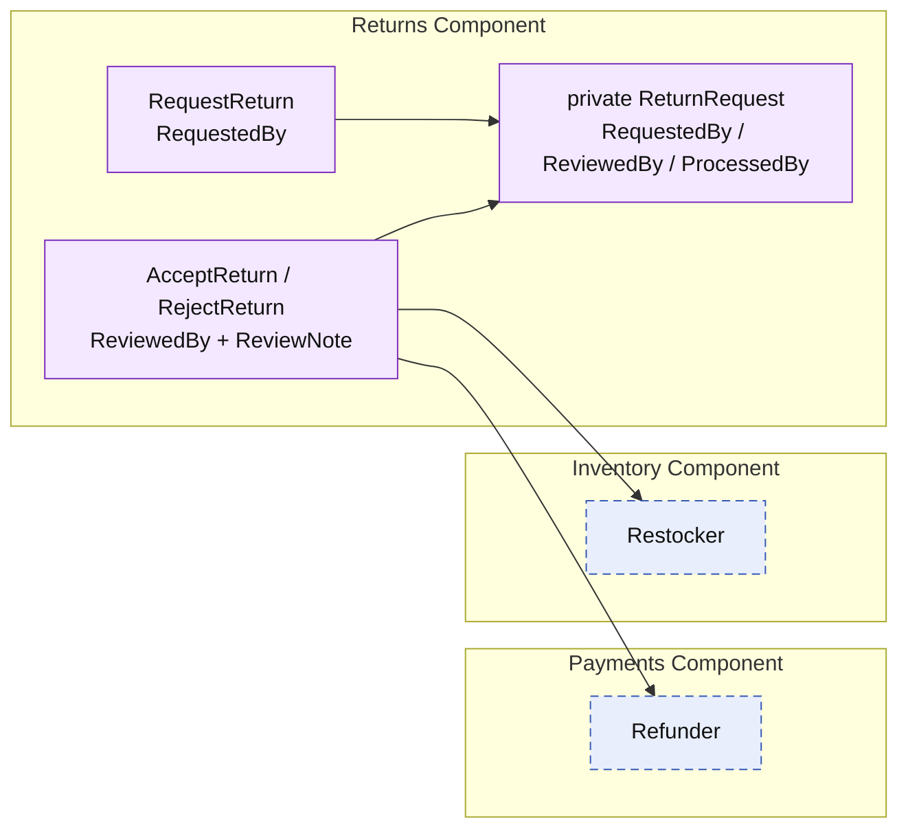

# Lesson 017: Return Actor Metadata

## Objective

Make the return workflow auditable by recording who requested, reviewed, and processed each return.

## Theory

The return workflow now records state, timing, and policy outcomes, but it does not say who performed each business action. This lesson makes actor and decision metadata part of Returns' private return-request record:

- `RequestedBy` is captured when a customer-service user opens the request.
- `ReviewedBy` and `ReviewNote` are captured when the request is accepted or rejected.
- `ProcessedBy` is captured only when an allowed acceptance triggers refund and restock.

Returns owns this information because it owns the workflow record. Payments and Inventory execute their narrow side effects without becoming an audit store for the whole return decision.

## Why This Matters Here

An operational workflow needs accountability: who asked, who decided, who completed the reversal, and why. Keeping that data with the return request preserves a coherent history without exposing Returns' private map to other components.

## Diagram

Legend:

- purple: Returns-owned behavior or private state
- blue dashed: provided side-effect contract
- solid arrows: runtime flow

## Implementation Focus

Implement only:

- requester metadata required when creating a return
- reviewer and review-note metadata recorded for acceptance and rejection
- processor metadata required and recorded only for a successful acceptance
- tests for missing actors and both review outcomes

Leave idempotency, role authorization, actor directories, and partial returns for later lessons.

## What To Verify

- `go test ./...` passes from `component-based-architecture/`
- a request without a requester is rejected
- an accepted return records reviewer, processor, and note
- a rejected return records reviewer and note, without refund or restock
