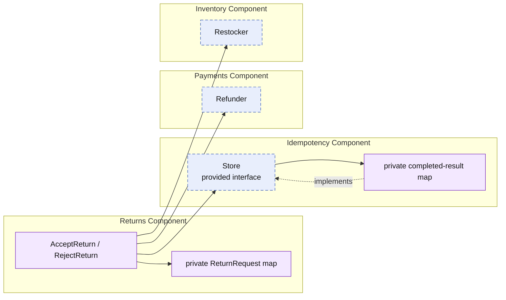

# Lesson 018: Return Command Idempotency

## Objective

Make return review commands retry-safe so a duplicate accept or reject request does not replay refund or restock side effects.

## Theory

Accepting a return now changes state and may refund payment and restock inventory. A timeout or double submission can cause the caller to retry that command, so simply rejecting the second request is not enough: the caller needs the same completed result without re-running side effects.

This lesson introduces a dedicated Idempotency component. Returns uses its provided `Store` contract to look up a review result by caller-supplied idempotency key before handling the workflow. After a successful acceptance or rejection, Returns stores the result under that key.

## Why This Matters Here

Retry safety is neither a payment concern nor an inventory concern. Returns owns the decision to make its review commands replay-safe; Idempotency owns the small record of completed results. The boundary keeps that reliability concern explicit without exposing either component's private maps.

## Diagram

Legend:

- purple: component-owned behavior or private state
- blue dashed: provided contract
- solid arrows: runtime flow
- dashed arrow: implementation relationship

## Implementation Focus

Implement only:

- Idempotency's `Store` contract and in-memory component
- a required idempotency key on return review commands
- a reusable `ReviewReturnResult` stored after acceptance or rejection
- replay handling that prevents duplicate refund and restock

Leave persistent idempotency storage, expiry, request fingerprinting, and idempotency for return creation for later lessons.

## What To Verify

- `go test ./...` passes from `component-based-architecture/`
- a repeated accept returns the original result and refunds/restocks once
- a repeated reject returns the original result with no side effects
- review commands without an idempotency key are rejected
