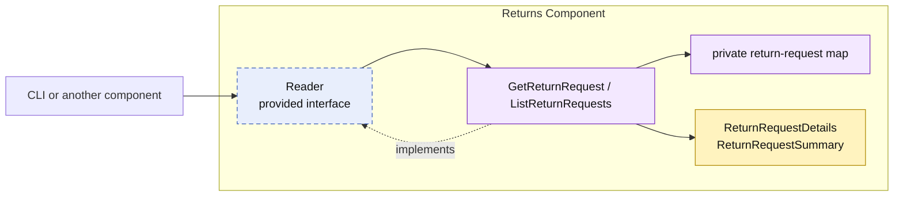

# Lesson 019: Return Query Surface

## Objective

Give Returns an explicit read surface so callers load return requests through a provided contract instead of accessing its private storage.

## Theory

Returns already owns a complete write workflow: request, policy review, audit metadata, and retry-safe completion. It also owns the return-request map. Reads should honor the same component boundary as writes.

This lesson adds a `Reader` contract, `GetReturnRequest`, and `ListReturnRequests`. Returns maps its private records into purpose-built detail and summary values. Callers receive the business data they need, never the map or mutable workflow record.

## Why This Matters Here

Without an explicit query surface, consumers eventually pressure the component to expose storage for reporting and status checks. That turns private state into a de facto API. A narrow read contract lets Returns choose and evolve its public view while keeping storage ownership intact.

## Diagram

Legend:

- purple: Returns-owned behavior or private state
- blue dashed: provided contract
- yellow: read model crossing the component boundary
- solid arrows: runtime flow
- dashed arrow: implementation relationship

## Implementation Focus

Implement only:

- the `returns.Reader` contract
- `GetReturnRequest` and `ListReturnRequests`
- immutable detail and summary values mapped from private return records
- tests and demo reads through the contract

Leave pagination, filtering beyond status, authorization, and cross-component reporting for later lessons.

## What To Verify

- `go test ./...` passes from `component-based-architecture/`
- a requested return can be loaded through `Reader`
- return requests can be listed by status
- the demo reads returns without direct map access
