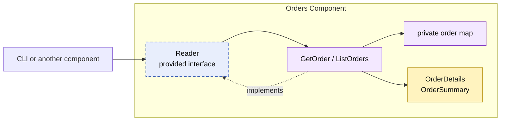

# Lesson 020: Order Query Surface

## Objective

Give Orders an explicit read surface so callers load orders through a provided contract instead of accessing private order state.

## Theory

Orders owns conversion, stock reservation, payment, shipping, cancellation, and the private order map. The same boundary should apply when callers need order status or details.

This lesson adds `orders.Reader`, `GetOrder`, and `ListOrders`. Orders maps its private records to detail and summary values, so a caller can read useful business state without receiving an `Order` object or access to the underlying map.

## Why This Matters Here

If every component exposes storage for reads, component boundaries become folders around shared data. A narrow query contract keeps Orders in charge of its public read model and prevents callers from depending on internal state shape.

## Diagram

## Implementation Focus

- `orders.Reader`, `GetOrder`, and `ListOrders`
- detail and summary read models mapped from private order records
- status filtering, tests, and demo usage through the contract

Leave pagination, richer filtering, authorization, and cross-component reporting for later lessons.

## What To Verify

- `go test ./...` passes from `component-based-architecture/`
- an order can be loaded through `Reader`
- orders can be listed by status
- the demo reads orders without direct map access
