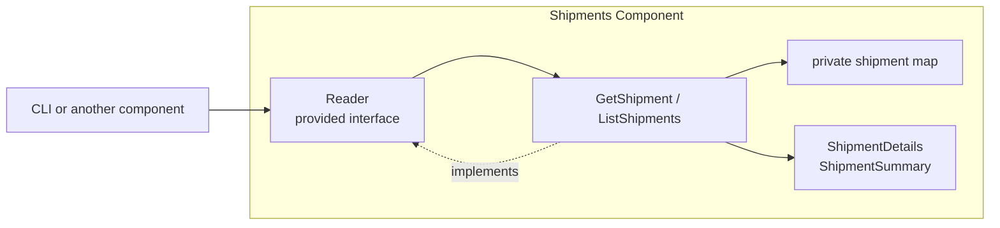

# Lesson 021: Shipment Query Surface

## Objective

Give Shipments an explicit read surface so callers load shipment records through a provided contract instead of accessing private shipment state.

## Theory

Shipments owns shipment creation and its private shipment map. Its read boundary should match that write boundary. This lesson adds a `shipments.Reader` contract with lookup and order-filtered listing operations that map private records to read-only values.

## Why This Matters Here

If callers read a component's storage directly, that storage becomes its real API. The query contract keeps Shipments in control of the data it exposes and lets its internal representation evolve independently.

## Diagram

## Implementation Focus

- `shipments.Reader`, `GetShipment`, and `ListShipments`
- immutable shipment detail and summary models
- order ID filtering, tests, and demo usage

Leave pagination, tracking integrations, and shipping-carrier queries for later lessons.

## What To Verify

- `go test ./...` passes from `component-based-architecture/`
- a shipment can be loaded through `Reader`
- shipments can be listed by order ID
- the demo reads shipments without direct map access
