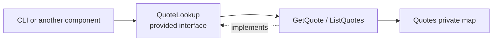

# Lesson 022: Quote List Query Surface

## Objective

Round out Quotes' read surface by listing quotes through its provided contract instead of exposing private quote state.

## Theory

Quotes already provides `GetQuote`, but callers browsing a workflow status would otherwise be tempted to access its map directly. This lesson extends `QuoteLookup` with `ListQuotes`, mapping private quotes to summaries filtered by status.

## Why This Matters Here

A component boundary should be consistent for one-item and multi-item reads. Keeping both on the provided contract prevents private storage from becoming the practical read API.

## Diagram

## Implementation Focus

- add `ListQuotes` to `QuoteLookup`
- expose status-filtered quote summaries
- add a test and demo read through the contract

Leave pagination, richer filtering, and reporting for later lessons.

## What To Verify

- `go test ./...` passes from `component-based-architecture/`
- approved quotes can be listed through `QuoteLookup`
- the demo lists quotes without direct map access
