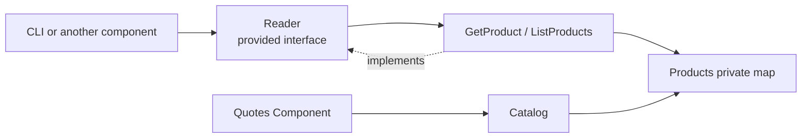

# Lesson 023: Product Query Surface

## Objective

Make Products an explicit read boundary for product lookup and browsing while retaining its specialized quote catalog contract.

## Theory

`GetProductForQuote` supplies the small sellable-product snapshot Quotes needs. General browsing is a different concern. This lesson adds a `products.Reader` contract with `GetProduct` and filtered `ListProducts`, mapping the private catalog into general read models.

## Why This Matters Here

Specialized collaboration contracts should not become accidental general APIs. Products now has both: a narrow catalog capability for Quotes and a deliberate read surface for other callers.

## Diagram

## Implementation Focus

- `products.Reader`, `GetProduct`, and `ListProducts`
- category and active-state filtering
- tests and demo usage through the read contract

Leave product administration, pagination, and search ranking for later lessons.

## What To Verify

- `go test ./...` passes from `component-based-architecture/`
- a product can be loaded through `Reader`
- products can be filtered by category and active state
- Quotes continues using its specialized `Catalog` contract
