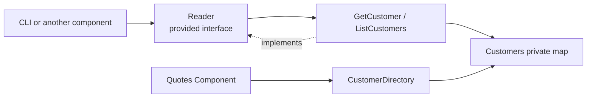

# Lesson 024: Customer Query Surface

## Objective

Promote Customers from a validation dependency into an explicit read surface with lookup and active-only listing through its component contract.

## Theory

Customers already provides `RequireActiveCustomer` for quote creation. This lesson adds a separate `Reader` contract with `GetCustomer` and `ListCustomers`, mapping private customer state into read models.

## Why This Matters Here

The validation contract and general read surface serve different consumers. Keeping both explicit prevents callers from reading the customer map directly and preserves Customers as the owner of its public data shape.

## Diagram

## Implementation Focus

- add customer read models and `Reader`
- support lookup and active-only listing
- preserve `RequireActiveCustomer` and add query tests/demo usage

## What To Verify

- `go test ./...` passes
- a customer loads through `Reader`
- active-only listing excludes inactive customers
- the demo reads customers through the contract
