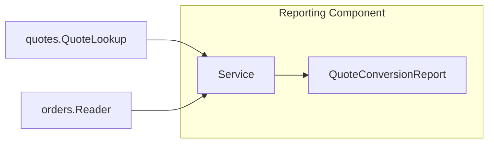

# Lesson 025: Quote Conversion Report

## Objective

Introduce the first projection-style report and make cross-component reporting depend on published query contracts rather than private storage.

## Theory

Reports combine concepts from more than one component. This lesson adds a Reporting component that reads quote summaries from `quotes.QuoteLookup` and order summaries from `orders.Reader`, then calculates total, approved, and converted counts plus a conversion rate.

## Why This Matters Here

Cross-component reporting is a common place for boundaries to erode. Keeping aggregation in its own component and consuming only public query contracts avoids direct map or repository access.

## Diagram

## Implementation Focus

- add a Reporting component with `QuoteConversionReport`
- depend on Quotes and Orders query contracts
- aggregate counts without direct storage access
- add tests and demo output

## What To Verify

- `go test ./...` passes
- quote and converted-order counts combine correctly
- the demo renders the report
