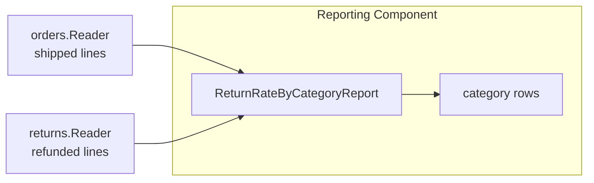

# Lesson 026: Return Rate By Category Report

## Objective

Add a category-based return-rate report that combines shipped order lines and refunded return lines through component query contracts.

## Theory

No single component owns this metric. Orders owns shipped quantities and Returns owns refunded quantities. A Reporting capability can combine their line-level read models and calculate shipped units, returned units, and return rate per category.

## Why This Matters Here

Analytics often tempts direct storage joins. Keeping the projection in Reporting and consuming only Orders and Returns read contracts preserves component ownership while making the aggregation explicit.

## Diagram

## Implementation Focus

- expose line-level category snapshots through Orders and Returns read models
- add a Reporting return-rate capability
- aggregate shipped and refunded quantities by category
- add tests and demo output

## What To Verify

- `go test ./...` passes
- shipped and refunded quantities group correctly
- the demo renders category return rates
